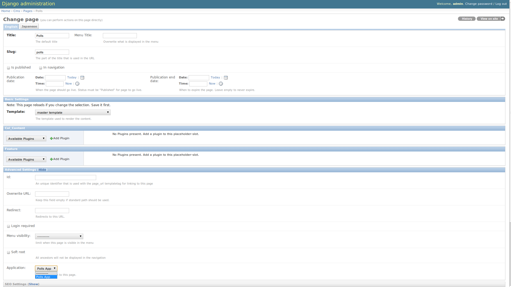

###########################
Extending the CMS: Examples
###########################

From this part onwards, this tutorial assumes you have done the
`Django Tutorial`_ and we will show you how to integrate that poll app into the
django CMS. If a poll app is mentioned here, we mean the one you get when
finishing the `Django Tutorial`_. 
Also, make sure the poll app is in your :setting:`django:INSTALLED_APPS`.

We assume your main ``urls.py`` looks somewhat like this::

    from django.conf.urls.defaults import *

    from django.contrib import admin
    admin.autodiscover()

    urlpatterns = patterns('',
        (r'^admin/', include(admin.site.urls)),
        (r'^polls/', include('polls.urls')),
        (r'^', include('cms.urls')),
    )

***************
My First Plugin
***************

A Plugin is a small bit of content you can place on your pages.

The Model
=========

For our polling app we would like to have a small poll plugin, that shows one
poll and let's the user vote.

In your poll application's ``models.py`` add the following model::

    from cms.models import CMSPlugin
    
    class PollPlugin(CMSPlugin):
        poll = models.ForeignKey('polls.Poll', related_name='plugins')
        
        def __unicode__(self):
          return self.poll.question

.. note::

    django CMS plugins must inherit from :class:`cms.models.CMSPlugin`
    (or a subclass thereof) and not
    :class:`models.Model <django.db.models.Model>`.

Run ``manage.py syncdb`` to create the database tables for this model or see
:doc:`../getting_started/using_south` to see how to do it using `South`_

The Plugin Class
================

Now create a file ``cms_plugins.py`` in the same folder your ``models.py`` is
in, so following the `Django Tutorial`_, your polls app folder should look like
this now::

    polls/
        __init__.py
        cms_plugins.py
        models.py
        tests.py
        views.py 

The plugin class is responsible to provide the django CMS with the necessary
information to render your Plugin.

For our poll plugin, write following plugin class::

    from cms.plugin_base import CMSPluginBase
    from cms.plugin_pool import plugin_pool
    from polls.models import PollPlugin as PollPluginModel
    from django.utils.translation import ugettext as _
    
    class PollPlugin(CMSPluginBase):
        model = PollPluginModel # Model where data about this plugin is saved
        name = _("Poll Plugin") # Name of the plugin
        render_template = "polls/plugin.html" # template to render the plugin with
    
        def render(self, context, instance, placeholder):
            context.update({'instance':instance})
            return context
    
    plugin_pool.register_plugin(PollPlugin) # register the plugin

.. note::

    All plugin classes must inherit from 
    :class:`cms.plugin_base.CMSPluginBase` and must register themselves
    with the :data:`cms.plugin_pool.plugin_pool`.

The Template
============

You probably noticed the
:attr:`render_template <cms.plugin_base.CMSPluginBase.render_template>`
attribute on that plugin class, for our plugin to work, that template must
exist and is responsible for rendering the plugin.

The template could look like this:

.. code-block:: html+django

    <h1>{{ instance.poll.question }}</h1>
    
    <form action="" method="post">
    
    
        <input type="radio" name="choice" id="choice{{ forloop.counter }}" value="{{ choice.id }}" />
        <label for="choice{{ forloop.counter }}">{{ choice.choice }}</label> 
    
    <input type="submit" value="Vote" />
    </form>

.. note::

    We don't show the errors here, because when submitting the form you're
    taken off this page to the actual voting page.

**********************
My First App (apphook)
**********************

Right now, external apps are statically hooked into the main ``urls.py``, that
is not the preferred way in the django CMS. Ideally you attach your apps to CMS
pages.

For that purpose you write a :class:`CMSApp <cms.app_base.CMSApp>`. That is
just a small class telling the CMS how to include that app.

CMS Apps live in a file called ``cms_app.py``, so go ahead and create that to
make your polls app look like this::

    polls/
        __init__.py
        cms_app.py
        cms_plugins.py
        models.py
        tests.py
        views.py 

In this file, write::

    from cms.app_base import CMSApp
    from cms.apphook_pool import apphook_pool
    from django.utils.translation import ugettext_lazy as _
    
    class PollsApp(CMSApp):
        name = _("Poll App") # give your app a name, this is required
        urls = ["polls.urls"] # link your app to url configuration(s)
        
    apphook_pool.register(PollsApp) # register your app
    
Now remove the inclusion of the polls urls in your main ``urls.py`` so it looks
like this::

    from django.conf.urls.defaults import *

    from django.contrib import admin
    admin.autodiscover()

    urlpatterns = patterns('',
        (r'^admin/', include(admin.site.urls)),
        (r'^', include('cms.urls')),
    )

Now open your admin in your browser and edit a CMS Page. Open the 'Advanced
Settings' tab and choose 'Polls App' for your 'Application'.

|apphooks|

Now for those changes to take effect, unfortunately you will have to restart
your server. So do that and now if you navigate to that CMS Page, you will see
your polls application.

*************
My First Menu
*************

Now you might have noticed that the menu tree stops at the CMS Page you created
in the last step, so let's create a menu that shows a node for each poll you
have active.

For this we need a file called ``menu.py``, create it and check your polls app
looks like this::

    polls/
        __init__.py
        cms_app.py
        cms_plugins.py
        menu.py
        models.py
        tests.py
        views.py

In your ``menu.py`` write::

    from cms.menu_bases import CMSAttachMenu
    from menus.base import Menu, NavigationNode
    from menus.menu_pool import menu_pool
    from django.core.urlresolvers import reverse
    from django.utils.translation import ugettext_lazy as _
    from polls.models import Poll
    
    class PollsMenu(CMSAttachMenu):
        name = _("Polls Menu") # give the menu a name, this is required.
        
        def get_nodes(self, request):
            """
            This method is used to build the menu tree.
            """
            nodes = []
            for poll in Poll.objects.all():
                # the menu tree consists of NavigationNode instances
                # Each NavigationNode takes a label as first argument, a URL as
                # second argument and a (for this tree) unique id as third
                # argument.
                node = NavigationNode(
                    poll.question,
                    reverse('polls.views.detail', args=(poll.pk,)),
                    poll.pk
                )
                nodes.append(node)
            return nodes
    menu_pool.register_menu(PollsMenu) # register the menu.

Now this menu alone doesn't do a whole lot yet, we have to attach it to the
Apphook first.

So open your ``cms_apps.py`` and write::

    from cms.app_base import CMSApp
    from cms.apphook_pool import apphook_pool
    from polls.menu import PollsMenu
    from django.utils.translation import ugettext_lazy as _
    
    class PollsApp(CMSApp):
        name = _("Poll App")
        urls = ["polls.urls"]
        menus = [PollsMenu] # attach a CMSAttachMenu to this apphook.
        
    apphook_pool.register(PollsApp)

.. _Django Tutorial: http://docs.djangoproject.com/en/1.2/intro/tutorial01/

.. _Python: http://www.python.org
.. _Django: http://www.djangoproject.com
.. _pip: http://pip.openplans.org/
.. _PIL: http://www.pythonware.com/products/pil/
.. _South: http://south.aeracode.org/
.. _django-classy-tags: https://github.com/ojii/django-classy-tags
