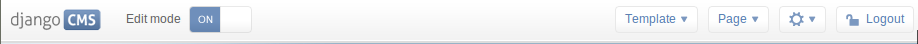
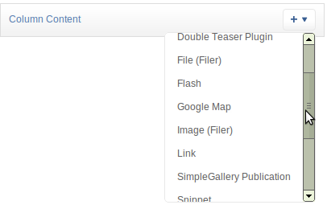

############################
Placeholders outside the CMS
############################

Placeholders are special model fields that django CMS uses to render
user-editable content (plugins) in templates. That is, it's the place where a
user can add text, video or any other plugin to a webpage, using either the
normal Django admin interface or the so called `frontend editing`.

Placeholders can be viewed as containers for :class:`CMSPlugin` instances, and
can be used outside the CMS in custom applications using the
:class:`~cms.models.fields.PlaceholderField`.

By defining one (or several) :class:`~cms.models.fields.PlaceholderField` on a custom model you can take
advantage of the full power of :class:`CMSPlugin`, including frontend editing.

**********
Quickstart
**********

You need to define a :class:`~cms.models.fields.PlaceholderField` on the model you would like to
use::

    from django.db import models
    from cms.models.fields import PlaceholderField

    class MyModel(models.Model):
        # your fields
        my_placeholder = PlaceholderField('placeholder_name')
        # your methods

The :class:`~cms.models.fields.PlaceholderField` takes a string as first
argument which will be used to configure which plugins can be used in this
placeholder. The configuration is the same as for placeholders in the CMS.

If you install this model in the admin application, you have to use
:class:`~cms.admin.placeholderadmin.PlaceholderAdmin` instead of
:class:`~django.contrib.admin.ModelAdmin` so the interface renders
correctly::

    from django.contrib import admin
    from cms.admin.placeholderadmin import PlaceholderAdmin
    from myapp import MyModel

    admin.site.register(MyModel, PlaceholderAdmin)

Now to render the placeholder in a template you use the
:ttag:`render_placeholder` tag from the
:mod:`~cms.templatetags.placeholder_tags` template tag library:

.. code-block:: html+django

    

    

The :ttag:`render_placeholder` tag takes a
:class:`~cms.models.fields.PlaceholderField` instance as first argument and
optionally accepts a width parameter as second argument for context sensitive
plugins.

*******************************
Adding content to a placeholder
*******************************

There are two ways to add or edit content to a placeholder, the front-end admin
view and the back-end view.

Using the front-end editor
==========================

Probably the most simple way to add content to a placeholder, simply visit the
page displaying your model (where you put the :ttag:`render_placeholder` tag),
then append ``?edit`` to the page's URL. This will make a top banner appear,
and after switching the "Edit mode" button to "on", the banner will prompt you
for your username and password (the user should be allowed to edit the page,
obviously).

You are now using the so-called *front-end edit mode*:

|edit-banner|

Once in Front-end editing mode, your placeholders should display a menu,
allowing you to add plugins to them: the following screen shot shows a
default selection of plugins in an empty placeholder.

|frontend-placeholder-add-plugin|

Plugins are rendered at once, so you can have an idea what it will look like
`in fine`, but to view the final look of a plugin simply leave edit mode by
clicking the "Edit mode" button in the banner again.

*********
Fieldsets
*********

There are some hard restrictions if you want to add custom fieldsets to an
admin page with at least one :class:`~cms.models.fields.PlaceholderField`:

1. Every :class:`~cms.models.fields.PlaceholderField` **must** be in it's own
   :attr:`fieldset <django.contrib.admin.ModelAdmin.fieldsets>`, one
   :class:`~cms.models.fields.PlaceholderField` per fieldset.
2. You **must** include the following two classes: ``'plugin-holder'`` and
   ``'plugin-holder-nopage'``
