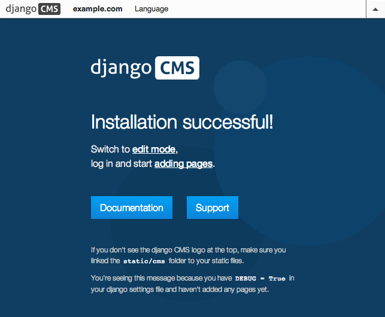
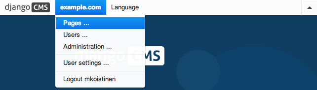
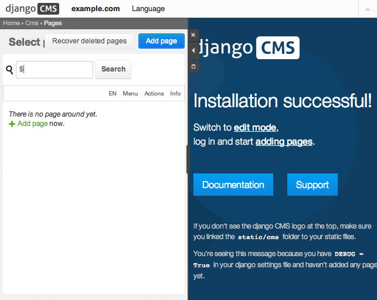
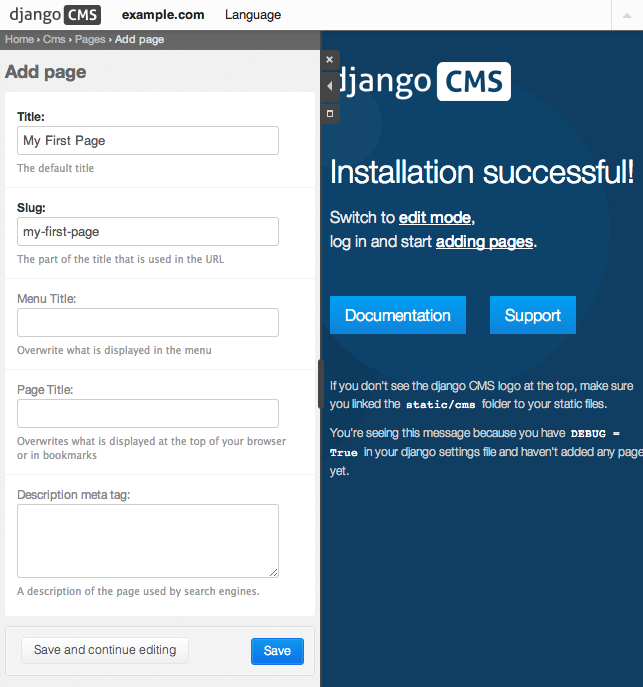
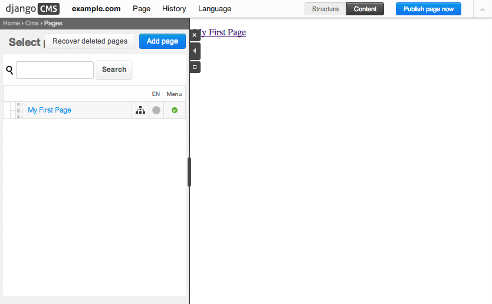
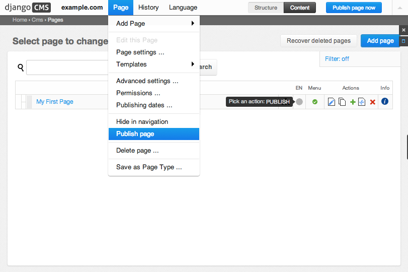
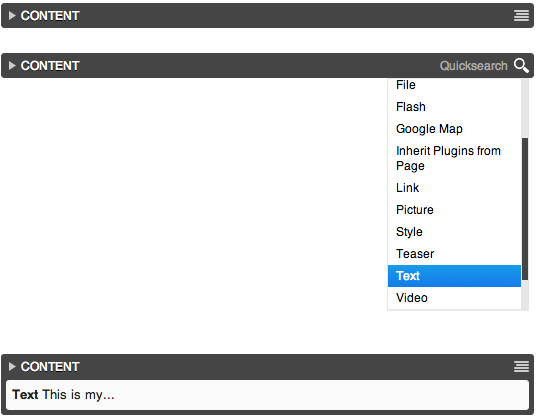

##############################################
Installing django CMS into an existing project
##############################################

This document assumes you are familiar with Python and Django. It should
outline the steps necessary for you to follow the :doc:`tutorial`.

.. _requirements:

************
Requirements
************

* `Python`_ 2.6, 2.7 or 3.3.
* `Django`_ 1.4.5, 1.5.x or 1.6.x
* `South`_ 0.8.4 or higher
* `django-classy-tags`_ 0.5 or higher
* `django-mptt`_ 0.6 (strict due to API compatibility issues)
* `django-sekizai`_ 0.7 or higher
* `html5lib`_ 0.99 or higher
* `djangocms-admin-style`_
* An installed and working instance of one of the databases listed in the
  `Databases`_ section.

.. note:: When installing the django CMS using pip, Django, django-mptt
          django-classy-tags, django-sekizai, south and html5lib will be
          installed automatically.

.. _Python: http://www.python.org
.. _Django: http://www.djangoproject.com
.. _South: http://south.aeracode.org/
.. _django-classy-tags: https://github.com/ojii/django-classy-tags
.. _django-mptt: https://github.com/django-mptt/django-mptt
.. _django-sekizai: https://github.com/ojii/django-sekizai
.. _html5lib: http://code.google.com/p/html5lib/
.. _django-i18nurls: https://github.com/brocaar/django-i18nurls
.. _djangocms-admin-style: https://github.com/divio/djangocms-admin-style

Recommended
===========

These packages are not *required*, but they provide useful functionality with
minimal additional configuration and are well-proven.

Text Editors
------------

* `Django CMS CKEditor`_ for a WYSIWYG editor 2.1.1 or higher

.. _Django CMS CKEditor: https://github.com/divio/djangocms-text-ckeditor

Other Plugins
-------------

* djangocms-link
* djangocms-snippet
* djangocms-style
* djangocms-column
* djangocms-grid
* djangocms-oembed
* djangocms-table

File and image handling
-----------------------

* `Django Filer`_ for file and image management
* `django-filer plugins for django CMS`_, required to use Django Filer with django CMS
* `Pillow`_ (fork of PIL) for image manipulation

.. _Django Filer: https://github.com/stefanfoulis/django-filer
.. _django-filer plugins for django CMS: https://github.com/stefanfoulis/cmsplugin-filer
.. _Pillow: https://github.com/python-imaging/Pillow

Revision management
-------------------

* `django-reversion`_ 1.6.6 (with Django 1.4.X), 1.7.X and 1.8 (exact) (with Django 1.5.X)
  or 1.8.X (with Django 1.6.X and Django 1.7.X) to support versions of your content (If using
  a different Django version it is a good idea to check the page
  `Compatible-Django-Versions`_ in the django-reversion wiki in order
  to make sure that the package versions are compatible.)

  .. note::

    As of django CMS 2.4, only the most recent 25 published revisions are
    saved. You can change this behaviour if required with
    :setting:`CMS_MAX_PAGE_PUBLISH_REVERSIONS`. Be aware that saved revisions
    will cause your database size to increase.

.. _django-reversion: https://github.com/etianen/django-reversion
.. _Compatible-Django-Versions: https://github.com/etianen/django-reversion/wiki/Compatible-Django-Versions

.. _installing-in-a-virtualenv-using-pip:

**********
Installing
**********

Installing in a virtualenv using pip
====================================

``pip install django-cms``

Installing inside a `virtualenv`_ is the preferred way to install any Django
installation. This should work on any platform where python in installed.
The first step is to create the virtualenv:

.. code-block:: bash

  #!/bin/sh
  sudo pip install --upgrade virtualenv
  virtualenv --distribute --no-site-packages env

.. note:: Since virtualenv v1.10 (2013-07-23) --distribute or --setuptools are
          the same because the new setuptools has been merged with Distribute.
          Since virtualenv v1.7 (2011-11-30) --no-site-packages was made the
          default behavior. By the way, we can create a virtualenv typing in our
          console only `virtualenv env`.

You can switch to your virtualenv at the command line by typing:

.. code-block:: bash

  source env/bin/activate

Next, you can install packages one at a time using `pip`_, but we recommend
using a `requirements.txt`_ file. The following is an example
requirements.txt file that can be used with pip to install django CMS and
its dependencies:

::

    # Bare minimum
    django-cms>=3.0

    # These dependencies are brought in by django CMS, but if you want to
    # lock-in their version, specify them
    Django>=1.6

    South==0.8.4
    django-mptt==0.6
    django-sekizai==0.7
    django-classy-tags==0.5
    djangocms-admin-style==0.2.2
    html5lib==1.0b1
    six==1.3.0

    # Optional, recommended packages
    Pillow==2.0.0
    django-filer==0.9.5
    cmsplugin-filer==0.9.5
    django-reversion==1.7

.. note::

    In the above list, packages are pinned to specific version as an example;
    those are not mandatory versions; refer to `requirements`_
    for any version-specific restriction

for Postgresql you would also add:

::

    psycopg2==2.5

and install libpq-dev (on Debian-based distro)

for MySQL you would also add:

::

    mysql-python==1.2.4

and install libmysqlclient-dev (on Debian-based distro)

One example of a script to create a virtualenv Python environment is as follows:

.. code-block:: bash

  #!/bin/sh
  env/bin/pip install --download-cache=~/.pip-cache -r requirements.txt

.. _virtualenv: http://www.virtualenv.org
.. _pip: http://www.pip-installer.org
.. _requirements.txt: http://www.pip-installer.org/en/latest/cookbook.html#requirements-files

Installing globally on Ubuntu
=============================

.. warning::

    The instructions here install certain packages, such as Django, South, Pillow
    and django CMS globally, which is not recommended. We recommend you use
    `virtualenv`_ instead (see above).

If you're using Ubuntu (tested with 14.04), the following should get you
started:

.. code-block:: bash

    sudo aptitude install python-pip
    sudo pip install virtualenv
    cd ~/workspace/myproject/
    virtualenv env
    source env/bin/activate
    pip install django-cms

Additionally, you need the Python driver for your selected database:

.. code-block:: bash

    sudo aptitude python-psycopg2

or

.. code-block:: bash

    sudo aptitude install python-mysql

This will install Django, django CMS, South, Pillow, and your database's driver globally.

You have now everything that is needed for you to follow the :doc:`tutorial`.

On Mac OSX
==========

All you need to do is

.. code-block:: bash

    $ sudo easy_install pip

If you're using `Homebrew`_ you can install pip and virtualenv with the python
generic package:

.. code-block:: bash

    $ brew install python

Then create an environment and work on it instead of install the packages in the
system path:

.. code-block:: bash

    $ virtualenv djangocms-env
    $ ./djangocms-env/bin/activate
    (djangocms-env)$ pip install Django-CMS

.. note:: You can see the general instructions on how to pip install packages
          after creating the virtualenv here: :ref:`Installing in a virtualenv using pip <installing-in-a-virtualenv-using-pip>`

.. _Homebrew: http://brew.sh/

*********
Databases
*********

We recommend using `PostgreSQL`_ or `MySQL`_ with django CMS. Installing and
maintaining database systems is outside the scope of this documentation, but
is very well documented on the systems' respective websites.

To use django CMS efficiently, we recommend:

* Creating a separate set of credentials for django CMS.
* Creating a separate database for django CMS to use.

.. _PostgreSQL: http://www.postgresql.org/
.. _MySQL: http://www.mysql.com

***********************
Configuration and setup
***********************

Preparing the environment
=========================

The following assumes your django project is in ``~/workspace/myproject/myproject``.

.. _configure-django-cms:

Installing and configuring django CMS in your django project
============================================================

Open the file ``~/workspace/myproject/myproject/settings.py``.

To make your life easier, add the following at the top of the file::

    # -*- coding: utf-8 -*-
    import os
    gettext = lambda s: s
    PROJECT_PATH = os.path.split(os.path.abspath(os.path.dirname(__file__)))[0]

Add the following apps to your :setting:`django:INSTALLED_APPS`.
This includes django CMS itself as well as its dependenices and
other highly recommended applications/libraries::

    'cms',  # django CMS itself
    'mptt',  # utilities for implementing a modified pre-order traversal tree
    'menus',  # helper for model independent hierarchical website navigation
    'south',  # intelligent schema and data migrations
    'sekizai',  # for javascript and css management
    'djangocms_admin_style',  # for the admin skin. You **must** add 'djangocms_admin_style' in the list **before** 'django.contrib.admin'.
    'django.contrib.messages',  # to enable messages framework (see :ref:`Enable messages <enable-messages>`)

Also add any (or all) of the following plugins, depending on your needs::

    'djangocms_file',
    'djangocms_flash',
    'djangocms_googlemap',
    'djangocms_inherit',
    'djangocms_picture',
    'djangocms_teaser',
    'djangocms_video',
    'djangocms_link',
    'djangocms_snippet',
    'djangocms_text_ckeditor',  # note this needs to be above the 'cms' entry

.. note::

    Most of the above plugins were previously distributed with django CMS,
    however, most of them are now located in their own repositories and
    renamed. Furthermore plugins: ``'cms.plugins.text'`` and
    ``'cms.plugins.twitter'`` have been removed from the django CMS bundle.
    Read :ref:`upgrade-to-3.0` for detailed information.

.. warning::

    Adding the ``'djangocms_snippet'`` plugin is a potential security hazard.
    For more information, refer to `snippet_plugin`_.

The plugins are described in more detail in chapter :doc:`Plugins reference
<../basic_reference/plugin_reference>`. There are even more plugins available on the django CMS
`extensions page`_.

.. _snippet_plugin: https://github.com/divio/djangocms-snippet
.. _extensions page: http://www.django-cms.org/en/extensions/

In addition, make sure you uncomment (enable) ``'django.contrib.admin'``

You may also wish to use `django-filer`_ and its components with the `django
CMS plugin`_ instead of the :mod:`djangocms_file`, :mod:`djangocms_picture`,
:mod:`djangocms_teaser` and :mod:`djangocms_video` core plugins. In this case
you should check the `django-filer documentation
<django-filer:installation_and_configuration>`_ and `django CMS plugin documentation`_
for detailed installation information, and then return to this tutorial.

.. _django-filer: https://github.com/stefanfoulis/django-filer
.. _django CMS plugin: https://github.com/stefanfoulis/cmsplugin-filer
.. _django CMS plugin documentation: https://github.com/stefanfoulis/cmsplugin-filer#installation

If you opt for the core plugins you should take care that directory to which
the :setting:`CMS_PAGE_MEDIA_PATH` setting points (by default ``cms_page_media/``
relative to :setting:`django:MEDIA_ROOT`) is writable by the user under which Django
will be running. If you have opted for django-filer there is a similar requirement
for its configuration.

If you want versioning of your content you should also install `django-reversion`_
and add it to :setting:`django:INSTALLED_APPS`:

* ``'reversion'``

.. _django-reversion: https://github.com/etianen/django-reversion

You need to add the django CMS middlewares to your :setting:`django:MIDDLEWARE_CLASSES`
at the right position::

    MIDDLEWARE_CLASSES = (
        'django.contrib.sessions.middleware.SessionMiddleware',
        'django.middleware.csrf.CsrfViewMiddleware',
        'django.contrib.auth.middleware.AuthenticationMiddleware',
        'django.contrib.messages.middleware.MessageMiddleware',
        'django.middleware.locale.LocaleMiddleware',
        'django.middleware.doc.XViewMiddleware',
        'django.middleware.common.CommonMiddleware',
        'cms.middleware.user.CurrentUserMiddleware',
        'cms.middleware.page.CurrentPageMiddleware',
        'cms.middleware.toolbar.ToolbarMiddleware',
        'cms.middleware.language.LanguageCookieMiddleware',
    )

You need at least the following :setting:`django:TEMPLATE_CONTEXT_PROCESSORS`::

    TEMPLATE_CONTEXT_PROCESSORS = (
        'django.contrib.auth.context_processors.auth',
        'django.contrib.messages.context_processors.messages',
        'django.core.context_processors.i18n',
        'django.core.context_processors.request',
        'django.core.context_processors.media',
        'django.core.context_processors.static',
        'sekizai.context_processors.sekizai',
        'cms.context_processors.cms_settings',
    )

.. note::

    This setting will be missing from automatically generated Django settings
    files, so you will have to add it.

.. warning::

    Be sure to have ``'django.contrib.sites'`` in INSTALLED_APPS and set
    ``SITE_ID`` parameter in your ``settings``: they may be missing from the
    settings file generated by ``django-admin`` depending on your Django version
    and project template.

.. _enable-messages:

.. versionchanged:: 3.0.0

.. warning::

    Django ``messages`` framework is now **required** for the toolbar to work
    properly.

    To enable it you must be check the following settings:

        * ``INSTALLED_APPS``: must contain ``'django.contrib.messages'``
        * ``MIDDLEWARE_CLASSES``: must contain ``'django.contrib.messages.middleware.MessageMiddleware'``
        * ``TEMPLATE_CONTEXT_PROCESSORS``: must contain ``'django.contrib.messages.context_processors.messages'``

Point your :setting:`django:STATIC_ROOT` to where the static files should live
(that is, your images, CSS files, Javascript files, etc.)::

    STATIC_ROOT = os.path.join(PROJECT_PATH, "static")
    STATIC_URL = "/static/"

For uploaded files, you will need to set up the :setting:`django:MEDIA_ROOT`
setting::

    MEDIA_ROOT = os.path.join(PROJECT_PATH, "media")
    MEDIA_URL = "/media/"

.. note::

    Please make sure both the ``static`` and ``media`` subfolders exist in your
    project and are writable.

Now add a little magic to the :setting:`django:TEMPLATE_DIRS` section of the file::

    TEMPLATE_DIRS = (
        # The docs say it should be absolute path: PROJECT_PATH is precisely one.
        # Life is wonderful!
        os.path.join(PROJECT_PATH, "templates"),
    )

Add at least one template to :setting:`CMS_TEMPLATES`; for example::

    CMS_TEMPLATES = (
        ('template_1.html', 'Template One'),
        ('template_2.html', 'Template Two'),
    )

We will create the actual template files at a later step, don't worry about it for
now. Simply paste this code into your settings file.

.. note::

    The templates you define in :setting:`CMS_TEMPLATES` have to exist at runtime and
    contain at least one ```` template tag to be useful
    for django CMS.

The django CMS allows you to edit all languages for which Django has built in
translations. Since these are numerous, we'll limit it to English for now::

    LANGUAGES = [
        ('en', 'English'),
    ]

Finally, set up the :setting:`django:DATABASES` part of the file to reflect your
database deployment. If you just want to try out things locally, sqlite3 is the
easiest database to set up, however it should not be used in production. If you
still wish to use it for now, this is what your :setting:`django:DATABASES`
setting should look like::

    DATABASES = {
        'default': {
            'ENGINE': 'django.db.backends.sqlite3',
            'NAME': os.path.join(PROJECT_PATH, 'database.sqlite'),
        }
    }

URL configuration
=================

You need to include the ``'cms.urls'`` urlpatterns **at the end** of your
urlpatterns. We suggest starting with the following
``~/workspace/myproject/myproject/urls.py``::

    from django.conf.urls import include, patterns, url
    from django.conf.urls.i18n import i18n_patterns
    from django.contrib import admin
    from django.conf import settings

    admin.autodiscover()

    urlpatterns = i18n_patterns('',
        url(r'^admin/', include(admin.site.urls)),
        url(r'^', include('cms.urls')),
    )

    if settings.DEBUG:
        urlpatterns = patterns('',
        url(r'^media/(?P<path>.*)$', 'django.views.static.serve',
            {'document_root': settings.MEDIA_ROOT, 'show_indexes': True}),
        url(r'', include('django.contrib.staticfiles.urls')),
    ) + urlpatterns

Creating templates
==================

django CMS uses templates to define how a page should look and what parts of
it are editable. Editable areas are called **placeholders**. These templates are
standard Django templates and you may use them as described in the
`official documentation`_.

Templates you wish to use on your pages must be declared in the :setting:`CMS_TEMPLATES`
setting::

  CMS_TEMPLATES = (
      ('template_1.html', 'Template One'),
      ('template_2.html', 'Template Two'),
  )

If you have followed this tutorial from the beginning, this code should
already be in your settings file.

Now, on with the actual template files!

Fire up your favorite editor and create a file called ``base.html`` in a folder called ``templates``
in your myproject directory.

Here is a simple example for a base template called ``base.html``:

.. code-block:: html+django

  
  <html>
    <head>
        <title></title>
        
    </head>
    <body>
        
        
        
        
    </body>
  </html>

Now, create a file called ``template_1.html`` in the same directory. This will use
your base template, and add extra content to it:

.. code-block:: html+django

  
  

  
    
  

When you set ``template_1.html`` as a template on a page you will get two
placeholders to put plugins in. One is ``template_1_content`` from the page
template ``template_1.html`` and another is ``base_content`` from the extended
``base.html``.

When working with a lot of placeholders, make sure to give descriptive
names to your placeholders so you can identify them more easily in the admin panel.

Now, feel free to experiment and make a ``template_2.html`` file! If you don't
feel creative, just copy template_1 and name the second placeholder something
like "template_2_content".

.. _sekizai-namespaces:

Static files handling with sekizai
----------------------------------

The django CMS handles media files (css stylesheets and javascript files)
required by CMS plugins using `django-sekizai`_. This requires you to define at
least two sekizai namespaces in your templates: ``js`` and ``css``. You can do
so using the ``render_block`` template tag from the ``sekizai_tags`` template
tag library. We highly recommended putting the ```` tag
as the last thing before the closing ``</head>`` HTML tag and the
```` tag as the last thing before the closing ``</body>``
HTML tag.

.. _django-sekizai: https://github.com/ojii/django-sekizai

Initial database setup
======================

This command depends on whether you **upgrade** your installation or do a
**fresh install**. We recommend that you get familiar with the way `South`_ works,
as it is a very powerful, easy and convenient tool. django CMS uses it extensively.

Fresh install
-------------

Run::

    python manage.py syncdb --all
    python manage.py migrate --fake

The first command will prompt you to create a super user. Choose 'yes' and enter
appropriate values.

Upgrade
-------

Run::

    python manage.py syncdb
    python manage.py migrate

Check you did everything right
==============================

Now, use the following command to check if you did everything correctly::

    python manage.py cms check

Up and running!
===============

That should be it. Restart your development server using ``python manage.py runserver``
and point a web browser to `127.0.0.1:8000 <http://127.0.0.1:8000>`_ : you should get
the django CMS "Installation Successful" screen.

|it-works-cms|

.. |it-works-cms| image:: ../images/it-works-cms.png

Use the new side-frame-based administration by appending '?edit' to your URL
as follows: `http://127.0.0.1:8000/?edit`. This will reveal a login form.

|login-form|

.. |login-form| image:: ../images/login-form.png

Log in with the user you created during the database setup.

To deploy your django CMS project on a production webserver, please refer to the
`Django documentation <http://docs.djangoproject.com/en/1.2/howto/deployment/>`_.

Creating your first CMS Page!
-----------------------------

That's it. Now the best part: you can start using the CMS! If you haven't
already, run your server with ``python manage.py runserver``, then point a web
browser to `127.0.0.1:8000/?edit <http://127.0.0.1:8000/?edit>`_ , and log
in using the super user credentials you defined when you ran ``syncdb``
earlier.

Once in the admin part of your site, you should see something like the following:

|logged-in|

Adding a page
-------------

Adding a page is as simple as clicking the "Pages..." menu-item in the
"example.com" (or similar) menu in the toolbar.

|pages-menu-item|

This will reveal the new side-frame for administration.

|no-pages|

Now, click the "add page" button at the top right-hand corner of the side-frame.

|basic-page-form|

This is a basic form where you complete the title of the new page. The slug
field is also required but a sensible value will be completed as you type the
page’s title.

Hitting the "Save" button, unsurprisingly, saves the page. It will now display in the list of
pages.

|my-first-page|

.. |my-first-page| image:: ../images/my-first-page.png

You can click the page title in the "page tree" to navigate to the page in the main window.

|empty-page|

Congratulations! You now have a fully functional django CMS installation!

Publishing a page
-----------------

There are multiple ways to publish a page including a blue "Publishe page now"
button on the right side of the toolbar if the page is not currently
published. Other ways include a "Publish page" menu item in the "Page" menu in
the toolbar and a publish link inside the "tool-tip" over the colored, round
icon in the language column of the page tree. The latter is useful for
publishing pages without first navigating to them.

Please review this image of the page-tree in the side-frame maximized with the
page menu invoked.

|page-options|

Menus
~~~~~

If you would like your page to appear in your menu (or note), you should
familiarize yourself with the option to include or exclude the page from
menus.

Reviewing the image in `publishing a page`_ above, you should also see the
"Hide in navigation" menu option. You can select this, or merely click on the
green checkbox icon beneath "Menu" in the page tree to exclude this page from
any menus.

Similarly, when the page is currently not shown in menus, you can use the
corresponding menu item "Show in navigation" or toggle the now red icon in the
page tree to again show the page in your menus.

Template
~~~~~~~~

Choosing a template for your page is as simple as selecting the desired
template from the "Templates" sub-menu (see image in `publishing a page`_
above). The list of available templates is determined by the CMS_TEMPLATES
list as defined in your project’s settings.

Adding content to a page
------------------------

So far, our page doesn't do much. Make sure it's marked as "published" (see
above), then click on the page's "edit" button.

To add content to your page, click the "structure" mode-button in the toolbar.
This will reveal all of the page’s available placeholders and allow you to add
CMS plugin instances to them.

On any placeholder, click the menu icon on the right side to reveal the list
of available plugins. In this case, we'll choose the Text plugin. Invoking the
Text plugin will display your installed WYSIWYG Text editor plugin. Type in
some text and press "Save". When you save the plugin, your plugin will now be
displayed "inside" the placeholder as shown in this progession of images.

|add-text-plugin|

To preview the page, click the "Content" mode button in the toolbar. You can
continue editing existing plugins in Content mode simply by double-clicking
the content they present. To add new plugins, or to re-arrange existing ones,
click back into Structure more. When you're ready to share your content with
the world, press the "Publish page now" button.

That's it!

Where to go from here
---------------------

Congratulations, you now have a fully functional CMS! Feel free to play around
with the different plugins provided out of the box and to build great websites!

Furthermore you can continue your introduction into django CMS on https://github.com/divio/django-cms-tutorial.

.. _TinyMCE: http://tinymce.moxiecode.com/
.. _official documentation: http://docs.djangoproject.com/en/1.5/topics/templates/
.. _mailinglist: https://groups.google.com/forum/#!forum/django-cms
