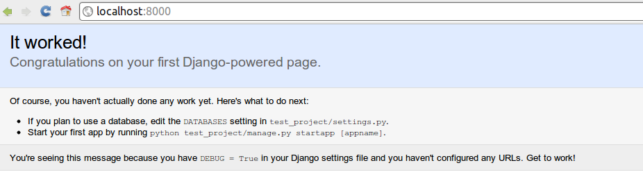
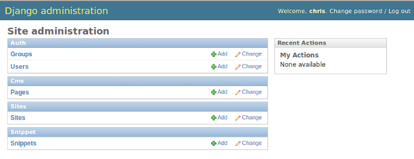
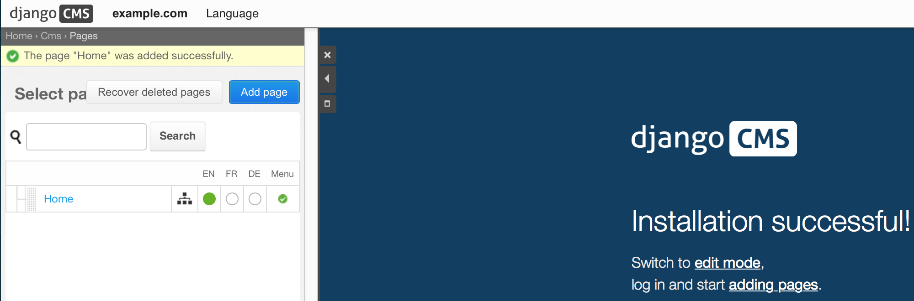
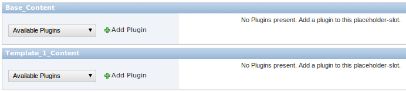
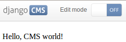

#####################
Introductory Tutorial
#####################

This guide assumes your machine meets the requirements outlined in the
:doc:`installation` section of this documentation.

************
Getting help
************

Should you run into trouble and can't figure out how to solve it yourself, you
can get help from either our `mailinglist`_ or IRC channel ``#django-cms`` on
the ``irc.freenode.net`` network.

***********************
Configuration and setup
***********************

Preparing the environment
=========================

Gathering the requirements is a good start, but we now need to give the CMS a 
Django project to live in, and configure it.

Starting your Django project
----------------------------

The following assumes your project will be in ``~/workspace/myproject/``.

Set up your Django project::

    cd ~/workspace
    django-admin.py startproject myproject
    cd myproject
    python manage.py runserver

Open `127.0.0.1:8000 <http://127.0.0.1:8000>`_ in your browser. You should see a
nice "It Worked" message from Django.

|it-worked|

Installing and configuring django CMS in your Django project
------------------------------------------------------------

Open the file ``~/workspace/myproject/settings.py``.

To make your life easier, add the following at the top of the file::

    # -*- coding: utf-8 -*-
    import os
    gettext = lambda s: s
    PROJECT_PATH = os.path.abspath(os.path.dirname(__file__))

Add the following apps to your :setting:`django:INSTALLED_APPS` which enable django CMS
and required or highly recommended applications/libraries):

* ``'cms'``, django CMS itself
* ``'mptt'``, utilities for implementing a modified pre-order traversal tree
* ``'menus'``, helper for model independent hierarchical website navigation
* ``'south'``, intelligent schema and data migrations
* ``'sekizai'``, for javascript and css management

Also add any (or all) of the following plugins, depending on your needs:

* ``'cms.plugins.file'``
* ``'cms.plugins.flash'``
* ``'cms.plugins.googlemap'``
* ``'cms.plugins.link'``
* ``'cms.plugins.picture'``
* ``'cms.plugins.snippet'``
* ``'cms.plugins.teaser'``
* ``'cms.plugins.text'``
* ``'cms.plugins.video'``
* ``'cms.plugins.twitter'``

They are described in more detail in chapter :doc:`Plugins reference <plugin_reference>`.
There is even more plugins available on django CMS `extensions page`_.

.. _extensions page: http://www.django-cms.org/en/extensions/

Further, make sure you uncomment (enable) ``'django.contrib.admin'``

You might consider using `django-filer`_ with `django CMS plugin`_ and its
components instead of :mod:`cms.plugins.file`, :mod:`cms.plugins.picture`,
:mod:`cms.plugins.teaser` and :mod:`cms.plugins.video` core plugins. In this
case you should not add them to :setting:`django:INSTALLED_APPS` but add those
instead:

* ``'filer'``
* ``'cmsplugin_filer_file'``
* ``'cmsplugin_filer_folder'``
* ``'cmsplugin_filer_image'``
* ``'cmsplugin_filer_teaser'``
* ``'cmsplugin_filer_video'``

.. _django-filer: https://github.com/stefanfoulis/django-filer
.. _django CMS plugin: https://github.com/stefanfoulis/cmsplugin-filer

If you opt for core plugins you should take care that directory to which
:setting:`CMS_PAGE_MEDIA_PATH` setting points (by default ``cms_page_media/``
relative to :setting:`django:MEDIA_ROOT`) is writable by the user under which Django
will be running. If you have opted for django-filer then similar requirement
exists based on its configuration.

If you want versioning of your content you should also install `django-reversion`_
and add it to :setting:`django:INSTALLED_APPS`:

* ``'reversion'``

.. _django-reversion: https://github.com/etianen/django-reversion

You need to add the django CMS middlewares to your :setting:`django:MIDDLEWARE_CLASSES`
at the right position::

    MIDDLEWARE_CLASSES = (
        'django.middleware.common.CommonMiddleware',
        'django.contrib.sessions.middleware.SessionMiddleware',
        'django.middleware.csrf.CsrfViewMiddleware',
        'django.contrib.auth.middleware.AuthenticationMiddleware',
        'django.contrib.messages.middleware.MessageMiddleware',
        'cms.middleware.multilingual.MultilingualURLMiddleware',
        'cms.middleware.page.CurrentPageMiddleware',
        'cms.middleware.user.CurrentUserMiddleware',
        'cms.middleware.toolbar.ToolbarMiddleware',
    )

You need at least the following :setting:`django:TEMPLATE_CONTEXT_PROCESSORS`::

    TEMPLATE_CONTEXT_PROCESSORS = (
        'django.contrib.auth.context_processors.auth',
        'django.core.context_processors.i18n',
        'django.core.context_processors.request',
        'django.core.context_processors.media',
        'django.core.context_processors.static',
        'cms.context_processors.media',
        'sekizai.context_processors.sekizai',
    )

.. note::
    
    This setting will be missing from automatically generated Django settings
    files, so you will have to add it.

Point your :setting:`django:STATIC_ROOT` to where the static files should live
(that is, your images, CSS files, Javascript files...)::

    STATIC_ROOT = os.path.join(PROJECT_PATH, "static")
    STATIC_URL = "/static/"
    ADMIN_MEDIA_PREFIX = "/static/admin/"

For uploaded files, you will need to set up the :setting:`django:MEDIA_ROOT`
setting::

    MEDIA_ROOT = os.path.join(PROJECT_PATH, "media")
    MEDIA_URL = "/media/"

.. note::

    Please make sure both the ``static`` and ``media`` subfolder exist in your
    project and are writable.

Now add a little magic to the :setting:`django:TEMPLATE_DIRS` section of the file::

    TEMPLATE_DIRS = (
        # The docs say it should be absolute path: PROJECT_PATH is precisely one.
        # Life is wonderful!
        os.path.join(PROJECT_PATH, "templates"),
    )

Add at least one template to :setting:`CMS_TEMPLATES`; for example::

    CMS_TEMPLATES = (
        ('template_1.html', 'Template One'),
        ('template_2.html', 'Template Two'),
    )

We will create the actual template files at a later step, don't worry about it for 
now, and simply paste this code in your settings file.

.. note::

    The templates you define in :setting:`CMS_TEMPLATES` have to exist at runtime and
    contain at least one ```` template tag to be useful
    for django CMS. For more details see `Creating templates`_
    
The django CMS will allow you to edit all languages which Django has built in
translations for, this is way too many so we'll limit it to English for now::

    LANGUAGES = [
        ('en', 'English'),
    ]

Finally, setup the :setting:`django:DATABASES` part of the file to reflect your
database deployment. If you just want to try out things locally, sqlite3 is the
easiest database to set up, however it should not be used in production. If you
still wish to use it for now, this is what your :setting:`django:DATABASES`
setting should look like::

    DATABASES = {
        'default': {
            'ENGINE': 'django.db.backends.sqlite3',
            'NAME': os.path.join(PROJECT_PATH, 'database.sqlite'),
        }
    }

URL configuration
=================

You need to include the ``'cms.urls'`` urlpatterns **at the end** of your
urlpatterns. We suggest starting with the following ``urls.py``::

    from django.conf.urls.defaults import *
    from django.contrib import admin
    from django.conf import settings

    admin.autodiscover()

    urlpatterns = patterns('',
        (r'^admin/', include(admin.site.urls)),
        url(r'^', include('cms.urls')),
    )

    if settings.DEBUG:
        urlpatterns = patterns('',
        url(r'^media/(?P<path>.*)$', 'django.views.static.serve',
            {'document_root': settings.MEDIA_ROOT, 'show_indexes': True}),
        url(r'', include('django.contrib.staticfiles.urls')),
    ) + urlpatterns

******************
Creating templates
******************

django CMS uses templates to define how a page should look and what parts of
it are editable. Editable areas are called **placeholders**. These templates are
standard Django templates and you may use them as described in the
`official documentation`_.

Templates you wish to use on your pages must be declared in the :setting:`CMS_TEMPLATES`
setting::

  CMS_TEMPLATES = (
      ('template_1.html', 'Template One'),
      ('template_2.html', 'Template Two'),
  )

If you followed this tutorial from the beginning, we already put this code in your settings file.

Now, on with the actual template files!

Fire up your favorite editor and create a file called ``base.html`` in a folder called ``templates``
in your myproject directory.

Here is a simple example for a base template called ``base.html``:

.. code-block:: html+django

  
  <html>
    <head>
        
    </head>
    <body>
        
        
        
    </body>
  </html>

Now, create a file called ``template_1.html`` in the same directory. This will use 
your base template, and add extra content to it:

.. code-block:: html+django

  
  

  
    
  

When you set ``template_1.html`` as a template on a page you will get two
placeholders to put plugins in. One is ``template_1_content`` from the page
template ``template_1.html`` and another is ``base_content`` from the extended
``base.html``.

When working with a lot of placeholders, make sure to give descriptive
names for your placeholders, to more easily identify them in the admin panel.

Now, feel free to experiment and make a ``template_2.html`` file! If you don't
feel creative, just copy template_1 and name the second placeholder something
like "template_2_content".

.. _sekizai-namespaces:

Static files handling with sekizai
==================================

The django CMS handles media files (css stylesheets and javascript files)
required by CMS plugins using `django-sekizai`_. This requires you to define at
least two sekizai namespaces in your templates: ``js`` and ``css``. You can do
so using the ``render_block`` template tag from the ``sekizai_tags`` template
tag libary. It is highly recommended to put the ```` tag
as last thing before the closing ``</head>`` HTML tag and the
```` tag as the last thing before the closing ``</body>``
HTML tag.

.. _django-sekizai: https://github.com/ojii/django-sekizai 

Initial database setup
======================

This command depends on whether you **upgrade** your installation or do a
**fresh install**. We recommend that you get familiar with the way `South`_ works, 
as it is a very powerful, easy and convenient tool. django CMS uses it extensively.

Fresh install
-------------

Run::

    python manage.py syncdb --all
    python manage.py migrate --fake

The first command will prompt you to create a super user; choose 'yes' and enter
appropriate values.

Upgrade
-------

Run::

    python manage.py syncdb
    python manage.py migrate

Up and running!
===============

That should be it. Restart your development server using ``python manage.py runserver`` 
and point a web browser to `127.0.0.1:8000 <http://127.0.0.1:8000>`_ :you should get 
the django CMS "It Worked" screen.

|it-works-cms|

.. |it-works-cms| image:: ../images/it-works-cms.png

Head over to the `admin panel <http://127.0.0.1:8000/admin/>` and log in with
the user you created during the database setup.

To deploy your django CMS project on a production webserver, please refer to the
`Django documentation <http://docs.djangoproject.com/en/1.2/howto/deployment/>`_.

*****************************
Creating your first CMS Page!
*****************************

That's it, now the best part: you can start using the CMS!
Run your server with ``python manage.py runserver``, then point a web browser to 
`127.0.0.1:8000/admin/ <http://127.0.0.1:8000/admin/>`_ , and log in using the super 
user credentials you defined when you ran ``syncdb`` earlier.

Once in the admin part of your site, you should see something like the following:

|first-admin| 

Adding a page
=============

Adding a page is as simple as clicking "Pages" in the admin view, then the "add page" button
on the top right-hand corner of the screen.

This is where you select which template to use (remember, we created two), as well as
pretty obvious things like which language the page is in (used for internationalisation),
the page's title, and the url slug it will use.

Hitting the "Save" button, well, saves the page. It will now display in the list of
pages.

|my-first-page|

Congratulations! You now have a fully functional django CMS installation!

Publishing a page
=================

The list of pages available is a handy way to change a few parameters about your pages:

Visibility
----------

By default, pages are "invisible". To let people access them you should mark
them as "published".

Menus
-----

Another option this view lets you tweak is whether or not the page should appear in
your site's navigation (that is, whether there should be a menu entry to reach it
or not)

Adding content to a page
========================

So far, our page doesn't do much. Make sure it's marked as "published", then
click on the page's "edit" button.

Ignore most of the interface for now, and click the "view on site" button on the 
top right-hand corner of the screen. As expected, your page is blank for the
time being, since our template is really a minimal one.

Let's get to it now then!

Press your browser's back button, so as to see the page's admin interface. If you followed 
the tutorial so far, your template (``template_1.html``) defines two placeholders.
The admin interfaces shows you theses placeholders as sub menus:

|first-placeholders|

Scroll down the "Available plugins" drop-down list. This displays the plugins you
added to your :setting:`django:INSTALLED_APPS` settings. Choose the "text" plugin in the drop-down,
then press the "Add" button.

The right part of the plugin area displays a rich text editor (`TinyMCE`_).

Type in whatever you please there, then press the "Save" button.

Go back to your website using the top right-hand "View on site" button. That's it!

|hello-cms-world|

Where to go from here
=====================

Congratulations, you now have a fully functional CMS! Feel free to play around 
with the different plugins provided out of the box, and build great websites!

.. _South: http://south.aeracode.org/
.. _TinyMCE: http://tinymce.moxiecode.com/
.. _official documentation: http://docs.djangoproject.com/en/1.2/topics/templates/
.. _mailinglist: https://groups.google.com/forum/#!forum/django-cms
