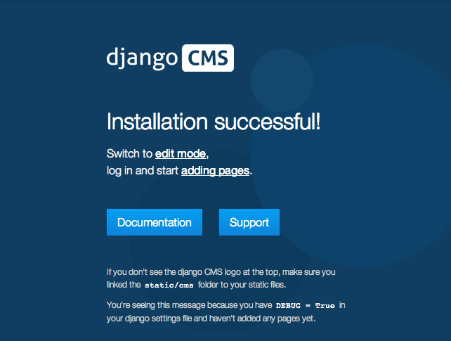
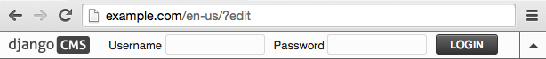

#############################
Installing django CMS by hand
#############################

This is how to install django CMS 'the hard way' (it's not really that hard, but there is an easier
way).

It's suitable if you want to dive in to integrating django CMS into an existing project, are already
experienced at setting up Django projects or indeed like to do things the hard way.

If you prefer an easier way using an automated configuration tool - definitely recommended for new
users - see :doc:`/introduction/install`, which is part of a complete introductory tutorial.

This document assumes you are familiar with Python and Django. After you've
integrated django CMS into your project, you should be able to follow the
:doc:`/introduction/index`.

.. _requirements:

************
Requirements
************

* `Python`_ 2.7, 3.3, 3.4 or 3.5.
* `Django`_ 1.8.x, 1.9.x
* `django-classy-tags`_ 0.7.0 or higher
* `django-treebeard`_ 4.0
* `django-sekizai`_ 0.8.2 or higher
* `html5lib`_ 0.9999999
* `djangocms-admin-style`_ 1.0 or higher
* An installed and working instance of one of the databases listed in the
  `Databases`_ section.

.. note:: When installing the django CMS using pip, all of the dependencies
          will be installed automatically.

.. _Python: https://www.python.org
.. _Django: https://www.djangoproject.com
.. _django-classy-tags: https://github.com/ojii/django-classy-tags
.. _django-treebeard: http://code.tabo.pe/django-treebeard/src
.. _django-sekizai: https://github.com/ojii/django-sekizai
.. _html5lib: https://github.com/html5lib/html5lib-python
.. _djangocms-admin-style: https://github.com/divio/djangocms-admin-style

Recommended
===========

These packages are not *required*, but they provide useful functionality with
minimal additional configuration and are well-proven.

Text Editors
------------

* `Django CMS CKEditor`_ for a WYSIWYG editor 2.8.1 or higher

.. _Django CMS CKEditor: https://github.com/divio/djangocms-text-ckeditor

Other Plugins
-------------

* djangocms-link
* djangocms-snippet
* djangocms-style
* djangocms-column
* djangocms-grid
* djangocms-oembed
* djangocms-table

File and image handling
-----------------------

* `Django Filer`_ for file and image management
* `django-filer plugins for django CMS`_, required to use Django Filer with django CMS
* `Pillow`_ (fork of PIL) for image manipulation

.. _Django Filer: https://github.com/stefanfoulis/django-filer
.. _django-filer plugins for django CMS: https://github.com/stefanfoulis/cmsplugin-filer
.. _Pillow: https://github.com/python-imaging/Pillow

Revision management
-------------------

* `django-reversion`_ 1.10 to support versions of your content

  .. note::

    As of django CMS 3.0.x, only the most recent 10 published revisions are
    saved. You can change this behaviour if required with
    :setting:`CMS_MAX_PAGE_PUBLISH_REVERSIONS`. Be aware that saved revisions
    will cause your database size to increase.

.. _django-reversion: https://github.com/etianen/django-reversion
.. _Compatible Django Versions: http://django-reversion.readthedocs.org/en/latest/django-versions.html

.. _installing-in-a-virtualenv-using-pip:

**********
Installing
**********

Installing in a virtualenv using pip
====================================

Installing inside a `virtualenv`_ is the preferred way to install any Django
installation.

.. code-block:: bash

  sudo pip install --upgrade virtualenv
  virtualenv env

.. note:: If you are *not* using a system-wide install of Python (such as with Homebrew),
          omit the usage of ``sudo`` when installing via ``pip``.

Switch to the virtualenv at the command line by typing:

.. code-block:: bash

  source env/bin/activate

Next, install the CMS:

.. code-block:: bash

  pip install django-cms

This will automatically install all of the `requirements`_ listed above.

While you could install packages one at a time using `pip`_, we recommend using a
`requirements.txt`_ file. The following is an example file that can be used with pip to install
django CMS and its dependencies:

::

    # Bare minimum
    django-cms>=3.0

    # These dependencies are brought in by django CMS, but if you want to
    # lock-in their version, specify them
    Django>=1.8

    django-treebeard==3.0
    django-sekizai==0.8.2
    django-classy-tags==0.6.2
    djangocms-admin-style==0.2.2
    html5lib==0.999
    six==1.3.0

    # Optional, recommended packages
    Pillow>=2
    django-filer==0.9.9
    cmsplugin-filer==0.10.1
    django-reversion==1.8.5

.. note::

    In the above list, packages are pinned to specific version as an example;
    those are not mandatory versions; refer to `requirements`_
    for any version-specific restrictions.

If you are using PostgreSQL as your database, add the Python adaptor to your
requirements file:

::

    psycopg2

For MySQL you would instead add:

::

    mysql-python

.. note::

    While the django CMS is compatible with Python 3.3+, the ``mysql-python`` package is not.

Before you install the Python adaptors for your chosen database, you will need to first
install the appropriate headers and development libraries. See the platform specific notes below.

.. _virtualenv: http://www.virtualenv.org
.. _pip: http://www.pip-installer.org
.. _requirements.txt: http://www.pip-installer.org/en/latest/cookbook.html#requirements-files

Installing on Ubuntu
====================

If you're using Ubuntu (tested with 14.04), the following should get you
started:

.. code-block:: bash

    sudo aptitude install python-pip
    sudo pip install virtualenv

Next, install the appropriate libraries to build the Python adaptors
for your selected database. For PostgreSQL:

.. code-block:: bash

    sudo aptitude install libpq-dev postgresql-client-9.3 python-dev

For MySQL:

.. code-block:: bash

    sudo aptitude install libmysqlclient-dev python-dev

Installing and configuring database servers are beyond the scope of this document.
See `Databases`_ below for more information and related links.

Installing on Mac OSX
=====================

If you are using the system provided Python (2.7 or later), ensure you have
``pip`` installed.

.. code-block:: bash

    sudo easy_install pip
    sudo pip install virtualenv

If you're using `Homebrew`_ you can install pip and virtualenv with the python
generic package:

.. code-block:: bash

    brew install python
    pip install virtualenv

Next, install the appropriate libraries to build the Python adaptors
for your selected database. For PostgreSQL:

.. code-block:: bash

    brew install postgres

For MySQL:

.. code-block:: bash

    brew install mysql

.. note:: Homebrew does not set the databases to run automatically. The software
          necessary for the Python adaptors will be installed but if you wish to
          run the database server locally, follow the Homebrew instructions shown
          in the terminal output after installing.

.. _Homebrew: http://brew.sh/

.. Databases:

*********
Databases
*********

We recommend using `PostgreSQL`_ or `MySQL`_ with django CMS. Installing and
maintaining database systems is outside the scope of this documentation, but
is very well documented on the systems' respective websites.

To use django CMS efficiently, we recommend:

* Creating a separate set of credentials for django CMS.
* Creating a separate database for django CMS to use.

.. _PostgreSQL: http://www.postgresql.org/
.. _MySQL: http://www.mysql.com

***********************
Configuration and setup
***********************

Preparing the environment
=========================

The following steps assume your Django project will be - or already is - in
``~/workspace/myproject``, and that you'll be using a virtualenv.

If you already have a virtualenv with a project in it, activate it and move on to :ref:`configure-django-cms`.

Otherwise:

.. code-block:: bash

    cd ~/workspace/myproject/
    virtualenv env
    source env/bin/activate
    pip install -r requirements.txt

Create a new Django project
===========================

::

    django-admin.py startproject myproject

If this is new to you, you ought to read the `official Django tutorial
<https://docs.djangoproject.com/en/dev/intro/tutorial01/>`_, which covers starting a new project.

.. _configure-django-cms:

Configuring your project for django CMS
=======================================

Open the ``settings.py`` file in your project.

To make your life easier, add the following at the top of the file::

    # -*- coding: utf-8 -*-
    import os
    gettext = lambda s: s
    BASE_DIR = os.path.dirname(os.path.dirname(__file__))

Add the following apps to your :setting:`django:INSTALLED_APPS`. This includes django CMS itself as
well as its dependencies and other highly recommended applications/libraries::

    'cms',  # django CMS itself
    'treebeard',  # utilities for implementing a tree
    'menus',  # helper for model independent hierarchical website navigation
    'sekizai',  # for JavaScript and CSS management
    'djangocms_admin_style',  # for the admin skin. You **must** add 'djangocms_admin_style' in the list **before** 'django.contrib.admin'.
    'django.contrib.messages',  # to enable messages framework (see :ref:`Enable messages <enable-messages>`)

Also add any (or all) of the following plugins, depending on your needs (see the note in
:ref:`installed_apps` about ordering)::

    'djangocms_file',
    'djangocms_googlemap',
    'djangocms_inherit',
    'djangocms_picture',
    'djangocms_teaser',
    'djangocms_video',
    'djangocms_link',
    'djangocms_snippet',

.. note::

    Most of the above plugins were previously distributed with django CMS,
    however, most of them are now located in their own repositories and
    renamed. Furthermore plugins: ``'cms.plugins.text'`` and
    ``'cms.plugins.twitter'`` have been removed from the django CMS bundle.
    Read :ref:`upgrade-to-3.0` for detailed information.

.. warning::

    Adding the ``'djangocms_snippet'`` plugin is a potential security hazard.
    For more information, refer to `snippet_plugin`_.

Some commonly-used plugins are described in more detail in
:doc:`/topics/commonly_used_plugins`. There are even more plugins available on
the django CMS `extensions page`_.

.. _snippet_plugin: https://github.com/divio/djangocms-snippet
.. _extensions page: http://www.django-cms.org/en/extensions/

In addition, make sure you uncomment (enable) ``'django.contrib.admin'``

You may also wish to use `django-filer`_ and its components with the `django
CMS plugin`_ instead of the :mod:`djangocms_file`, :mod:`djangocms_picture`,
:mod:`djangocms_teaser` and :mod:`djangocms_video` core plugins. In this case
you should check the `django-filer documentation
<django-filer:installation_and_configuration>`_ and `django CMS plugin documentation`_
for detailed installation information, and then return to this tutorial.

.. _django-filer: https://github.com/stefanfoulis/django-filer
.. _django CMS plugin: https://github.com/stefanfoulis/cmsplugin-filer
.. _django CMS plugin documentation: https://github.com/stefanfoulis/cmsplugin-filer#installation

If you opt for the core plugins you should take care that directory to which
the :setting:`CMS_PAGE_MEDIA_PATH` setting points (by default ``cms_page_media/``
relative to :setting:`django:MEDIA_ROOT`) is writeable by the user under which Django
will be running. If you have opted for django-filer there is a similar requirement
for its configuration.

If you want versioning of your content you should also install `django-reversion`_
and add it to :setting:`django:INSTALLED_APPS`:

* ``'reversion'``

You need to add the django CMS middlewares to your :setting:`django:MIDDLEWARE_CLASSES`
at the right position::

    MIDDLEWARE_CLASSES = (
        'cms.middleware.utils.ApphookReloadMiddleware',
        'django.contrib.sessions.middleware.SessionMiddleware',
        'django.middleware.csrf.CsrfViewMiddleware',
        'django.contrib.auth.middleware.AuthenticationMiddleware',
        'django.contrib.messages.middleware.MessageMiddleware',
        'django.middleware.locale.LocaleMiddleware',
        'django.middleware.common.CommonMiddleware',
        'cms.middleware.user.CurrentUserMiddleware',
        'cms.middleware.page.CurrentPageMiddleware',
        'cms.middleware.toolbar.ToolbarMiddleware',
        'cms.middleware.language.LanguageCookieMiddleware',
    )

Notice that django CMS v3.2 introduces a new middleware:
``cms.middleware.utils.ApphookReloadMiddleware``. This should be placed very
near the top of your middleware classes tuple/list.

.. note::

    In Django 1.8, the ``TEMPLATE_DIRS``, ``TEMPLATE_LOADERS`` and ``TEMPLATE_CONTEXT_PROCESSORS``
    settings are rolled into the ``TEMPLATES`` setting.

    For earlier versions, put the ``context_processors`` and items listed into
    ``TEMPLATE_CONTEXT_PROCESSORS``, the ``DIRS`` items into ``TEMPLATE_DIRS`` and so on.

.. code-block:: python
   :emphasize-lines: 7,8

    TEMPLATES = [
        {
            'DIRS': [os.path.join(BASE_DIR, "templates"),],
            'OPTIONS': {
                'context_processors': [
                    # ...
                    'sekizai.context_processors.sekizai',
                    'cms.context_processors.cms_settings',
                    ],
                },
            },
        ]

.. warning::

    Be sure to have ``'django.contrib.sites'`` in INSTALLED_APPS and set
    ``SITE_ID`` parameter in your ``settings``: they may be missing from the
    settings file generated by ``django-admin`` depending on your Django version
    and project template.

.. _enable-messages:

.. versionchanged:: 3.0.0

.. warning::

    Django ``messages`` framework is now **required** for the toolbar to work
    properly.

    To enable it you must be check the following settings:

        * ``INSTALLED_APPS``: must contain ``'django.contrib.messages'``
        * ``MIDDLEWARE_CLASSES``: must contain ``'django.contrib.messages.middleware.MessageMiddleware'``
        * ``TEMPLATES["OPTIONS"]["context_processors"]``: must contain ``'django.contrib.messages.context_processors.messages'``

Point your :setting:`django:STATIC_ROOT` to where the static files should live
(that is, your images, CSS files, JavaScript files, etc.)::

    STATIC_ROOT = os.path.join(BASE_DIR, "static")
    STATIC_URL = "/static/"

For uploaded files, you will need to set up the :setting:`django:MEDIA_ROOT`
setting::

    MEDIA_ROOT = os.path.join(BASE_DIR, "media")
    MEDIA_URL = "/media/"

.. note::

    Please make sure both the ``static`` and ``media`` sub-folders exist in your
    project and are writeable.

Add at least one template to :setting:`CMS_TEMPLATES`; for example::

    CMS_TEMPLATES = (
        ('template_1.html', 'Template One'),
        ('template_2.html', 'Template Two'),
    )

We will create the actual template files at a later step, don't worry about it for
now. Simply paste this code into your settings file.

.. note::

    The templates you define in :setting:`CMS_TEMPLATES` have to exist at runtime and
    contain at least one ```` template tag to be useful
    for django CMS.

The django CMS allows you to edit all languages for which Django has built in
translations. Since these are numerous, we'll limit it to English for now::

    LANGUAGES = [
        ('en', 'English'),
    ]

Finally, set up the :setting:`django:DATABASES` part of the file to reflect your
database deployment. If you just want to try out things locally, SQLite3 is the
easiest database to set up, however it should not be used in production. If you
still wish to use it for now, this is what your :setting:`django:DATABASES`
setting should look like::

    DATABASES = {
        'default': {
            'ENGINE': 'django.db.backends.sqlite3',
            'NAME': os.path.join(BASE_DIR, 'database.sqlite'),
        }
    }

django CMS, as well as its plugins, supports both Django 1.7 and Django 1.6
migrations.

Since version 3.1, migrations are stored in modules compatible with Django 1.7
**and** South 1.0.2 without further configuration.

If you're using Django 1.6 and South earlier then version 1.0.2, you may need to
add this to settings if you also use any of the following plugins::

    SOUTH_MIGRATION_MODULES = {
        'djangocms_file': 'djangocms_file.south_migrations',
        'djangocms_googlemap': 'djangocms_googlemap.south_migrations',
        'djangocms_inherit': 'djangocms_inherit.south_migrations',
        'djangocms_link': 'djangocms_link.south_migrations',
        'djangocms_picture': 'djangocms_picture.south_migrations',
        'djangocms_snippet': 'djangocms_snippet.south_migrations',
        'djangocms_teaser': 'djangocms_teaser.south_migrations',
        'djangocms_video': 'djangocms_video.south_migrations',
        'djangocms_text_ckeditor': 'djangocms_text_ckeditor.south_migrations',
    }

Note that older versions of some of the above plugins may use non-standard
locations for South and Django migrations. Please check each installed plugin
configuration option to see how to configure Django migrations support.

URL configuration
=================

You need to include the ``'cms.urls'`` ``urlpatterns`` **at the end** of your
``urlpatterns``. We suggest starting with the following
``~/workspace/myproject/myproject/urls.py``::

    from django.conf import settings
    from django.conf.urls import include, url
    from django.conf.urls.i18n import i18n_patterns
    from django.conf.urls.static import static
    from django.contrib import admin

    urlpatterns = i18n_patterns('',
        url(r'^admin/', include(admin.site.urls)),
        url(r'^', include('cms.urls')),
    ) + static(settings.MEDIA_URL, document_root=settings.MEDIA_ROOT)

Creating templates
==================

django CMS uses templates to define how a page should look and what parts of
it are editable. Editable areas are called **placeholders**. These templates are
standard Django templates and you may use them as described in the
`official documentation`_.

Templates you wish to use on your pages must be declared in the :setting:`CMS_TEMPLATES`
setting::

  CMS_TEMPLATES = (
      ('template_1.html', 'Template One'),
      ('template_2.html', 'Template Two'),
  )

If you have followed this tutorial from the beginning, this code should
already be in your settings file.

Now, on with the actual template files!

Fire up your favourite editor and create a file called ``base.html`` in a folder called
``templates`` in your ``myproject`` directory.

Here is a simple example for a base template called ``base.html``:

.. code-block:: html+django

  
  <html>
    <head>
        <title></title>
        
    </head>
    <body>
        
        
        
        
    </body>
  </html>

Now, create a file called ``template_1.html`` in the same directory. This will use
your base template, and add extra content to it:

.. code-block:: html+django

  
  

  
    
  

When you set ``template_1.html`` as a template on a page you will get two
placeholders to put plugins in. One is ``template_1_content`` from the page
template ``template_1.html`` and another is ``base_content`` from the extended
``base.html``.

When working with a lot of placeholders, make sure to give descriptive
names to your placeholders so you can identify them more easily in the admin panel.

Now, feel free to experiment and make a ``template_2.html`` file! If you don't
feel creative, just copy template_1 and name the second placeholder something
like "template_2_content".

.. _sekizai-namespaces:

Static files handling with sekizai
----------------------------------

The django CMS handles media files (CSS stylesheets and JavaScript files)
required by CMS plugins using `django-sekizai`_. This requires you to define at
least two sekizai namespaces in your templates: ``js`` and ``css``. You can do
so using the ``render_block`` template tag from the ``sekizai_tags`` template
tag library. We highly recommended putting the ```` tag
as the last thing before the closing ``</head>`` HTML tag and the
```` tag as the last thing before the closing ``</body>``
HTML tag.

Initial database setup
======================

django CMS uses Django's built-in support for database migrations to manage
creating and altering database tables.

Fresh install
-------------

Run::

    python manage.py migrate
    python manage.py createsuperuser

Upgrade
-------

If you are upgrading your installation of django CMS from a previous version run::

    python manage.py migrate

Check you did everything right
==============================

Now, use the following command to check if you did everything correctly::

    python manage.py cms check

Up and running!
===============

That should be it. Restart your development server using ``python manage.py runserver``
and point a web browser to `127.0.0.1:8000 <http://127.0.0.1:8000>`_ : you should get
the django CMS "Installation Successful" screen.

|it-works-cms|

Use the new side-frame-based administration by appending '?edit' to your URL
as follows: `http://127.0.0.1:8000/?edit`. This will reveal a login form.

|login-form|

Log in with the user you created during the database setup.

If this is your first django CMS project, read through the `tutorial`_ for a
walk-through of the main features of django CMS.

For more information on using django CMS for managing web content, see
:doc:`/user/index`.

To deploy your django CMS project on a production web server, please refer to the
`Django documentation <http://docs.djangoproject.com/en/dev/howto/deployment/>`_.

.. _official documentation: http://docs.djangoproject.com/en/stable/topics/templates/
.. _tutorial: https://github.com/divio/django-cms-tutorial
