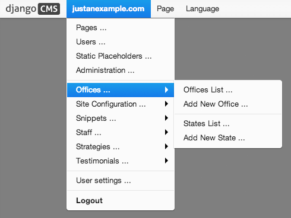

.. _toolbar_how_to:

#####################
Extending the Toolbar
#####################

.. versionadded:: 3.0

You can add and remove toolbar items. This allows you to integrate django CMS's frontend editing
mode into your application, and provide your users with a streamlined editing experience.

For the toolbar API reference, please refer to :ref:`toolbar-api-reference`.

.. important:: **Overlay** and **sideframe**

    Then django CMS *sideframe* has been replaced with an *overlay* mechanism. The API still refers
    to the ``sideframe``, because it is invoked in the same way, and what has changed is merely the
    behaviour in the user's browser.

    In other words, *sideframe* and the *overlay* refer to different versions of the same thing.

***********
Registering
***********

There are two ways to control what gets shown in the toolbar.

One is the :setting:`CMS_TOOLBARS`. This gives you full control over which
classes are loaded, but requires that you specify them all manually.

The other is to provide ``cms_toolbars.py`` files in your apps, which will be
automatically loaded as long :setting:`CMS_TOOLBARS` is not set (or is set to
``None``).

If you use the automated way, your ``cms_toolbars.py`` file should contain
classes that extend ``cms.toolbar_base.CMSToolbar`` and are registered using :meth:`cms.toolbar_pool.toolbar_pool.register`.
The register function can be used as a decorator.

These classes have four attributes:
* ``toolbar`` (the toolbar object)
* ``request`` (the current request)
* ``is_current_app`` (a flag indicating whether the current request is handled by the same app as the function is in)
* ``app_path`` (the name of the app used for the current request)

These classes must implement a ``populate`` or ``post_template_populate`` function. An optional
``request_hook`` function is available for you to overwrite as well.

* The populate functions will only be called if the current user is a staff user.
* The ``populate`` function will be called before the template and plugins are rendered.
* The ``post_template_populate`` function will be called after the template is rendered.
* The ``request_hook`` function is called before the view and may return a response. This way you
  can issue redirects from a toolbar if needed

These classes can define an optional ``supported_apps`` attribute, specifying which applications
the toolbar will work with. This is useful when the toolbar is defined in a different application
from the views it's related to.

``supported_apps`` is a tuple of application dotted paths (e.g: ``supported_apps =
('whatever.path.app', 'another.path.app')``.

A simple example, registering a class that does nothing::

    from cms.toolbar_pool import toolbar_pool
    from cms.toolbar_base import CMSToolbar

    @toolbar_pool.register
    class NoopModifier(CMSToolbar):

        def populate(self):
            pass

        def post_template_populate(self):
            pass

        def request_hook(self):
            pass

.. note:: Up to version 3.1 the module was named ``cms_toolbar.py``. Please
          update your existing modules to the new naming convention.
          Support for the old name will be removed in version 3.4.

.. warning::

    As the toolbar passed to ``post_template_populate`` has been already populated with items from
    other applications, it might contain different items when processed by ``populate``.

.. tip::

    You can change the toolbar or add items inside a plugin render method
    (``context['request'].toolbar``) or inside a view (``request.toolbar``)

************
Adding items
************

Items can be added through the various :ref:`APIs <toolbar-api-reference>`
exposed by the toolbar and its items.

To add a :class:`cms.toolbar.items.Menu` to the toolbar, use
:meth:`cms.toolbar.toolbar.CMSToolbar.get_or_create_menu`.

Then, to add a link to your changelist that will open in the sideframe, use the
:meth:`cms.toolbar.items.ToolbarMixin.add_sideframe_item` method on the menu
object returned.

When adding items, all arguments other than the name or identifier should be
given as **keyword arguments**. This will help ensure that your custom toolbar
items survive upgrades.

Following our :doc:`/introduction/toolbar`, let's add the poll app
to the toolbar::

    from django.core.urlresolvers import reverse
    from django.utils.translation import ugettext_lazy as _
    from cms.toolbar_pool import toolbar_pool
    from cms.toolbar_base import CMSToolbar

    @toolbar_pool.register
    class PollToolbar(CMSToolbar):

        def populate(self):
            if self.is_current_app:
                menu = self.toolbar.get_or_create_menu('poll-app', _('Polls'))
                url = reverse('admin:polls_poll_changelist')
                menu.add_sideframe_item(_('Poll overview'), url=url)

However, there's already a menu added by the CMS which provides access to
various admin views, so you might want to add your menu as a sub menu there.
To do this, you can use positional insertion coupled with the fact that
:meth:`cms.toolbar.toolbar.CMSToolbar.get_or_create_menu` will return already existing
menus::

    from django.core.urlresolvers import reverse
    from django.utils.translation import ugettext_lazy as _
    from cms.toolbar_pool import toolbar_pool
    from cms.toolbar.items import Break
    from cms.cms_toolbars import ADMIN_MENU_IDENTIFIER, ADMINISTRATION_BREAK
    from cms.toolbar_base import CMSToolbar

    @toolbar_pool.register
    class PollToolbar(CMSToolbar):

        def populate(self):
            admin_menu = self.toolbar.get_or_create_menu(ADMIN_MENU_IDENTIFIER, _('Site'))
            position = admin_menu.find_first(Break, identifier=ADMINISTRATION_BREAK)
            menu = admin_menu.get_or_create_menu('poll-menu', _('Polls'), position=position)
            url = reverse('admin:polls_poll_changelist')
            menu.add_sideframe_item(_('Poll overview'), url=url)
            admin_menu.add_break('poll-break', position=menu)

If you wish to simply detect the presence of a menu without actually creating
it, you can use :meth:`cms.toolbar.toolbar.CMSToolbar.get_menu`, which will
return the menu if it is present, or, if not, will return ``None``.

*****************************
Modifying an existing toolbar
*****************************

If you need to modify an existing toolbar (say to change the ``supported_apps`` attribute) you can
do this by extending the original one, and modifying the appropriate attribute.

If :setting:`CMS_TOOLBARS` is used to register the toolbars, add your own toolbar instead of the
original one, otherwise unregister the original and register your own::

    from cms.toolbar_pool import toolbar_pool
    from third.party.app.cms.toolbar_base import FooToolbar

    @toolbar_pool.register
    class BarToolbar(FooToolbar):
        supported_apps = ('third.party.app', 'your.app')

    toolbar_pool.unregister(FooToolbar)

===========================
Adding Items Alphabetically
===========================

Sometimes it is desirable to add sub-menus from different applications
alphabetically. This can be challenging due to the non-obvious manner in which
your apps will be loaded into Django and is further complicated when you add new
applications over time.

To aid developers, django-cms exposes a :meth:`cms.toolbar.items.ToolbarMixin.get_alphabetical_insert_position`
method, which, if used consistently, can produce alphabetised sub-menus, even
when they come from multiple applications.

An example is shown here for an 'Offices' app, which allows handy access to
certain admin functions for managing office locations in a project::

    from django.core.urlresolvers import reverse
    from django.utils.translation import ugettext_lazy as _
    from cms.toolbar_base import CMSToolbar
    from cms.toolbar_pool import toolbar_pool
    from cms.toolbar.items import Break, SubMenu
    from cms.cms_toolbars import ADMIN_MENU_IDENTIFIER, ADMINISTRATION_BREAK

    @toolbar_pool.register
    class OfficesToolbar(CMSToolbar):

        def populate(self):
            #
            # 'Apps' is the spot on the existing djang-cms toolbar admin_menu
            # 'where we'll insert all of our applications' menus.
            #
            admin_menu = self.toolbar.get_or_create_menu(
                ADMIN_MENU_IDENTIFIER, _('Apps')
            )

            #
            # Let's check to see where we would insert an 'Offices' menu in the
            # admin_menu.
            #
            position = admin_menu.get_alphabetical_insert_position(
                _('Offices'),
                SubMenu
            )

            #
            # If zero was returned, then we know we're the first of our
            # applications' menus to be inserted into the admin_menu, so, here
            # we'll compute that we need to go after the first
            # ADMINISTRATION_BREAK and, we'll insert our own break after our
            # section.
            #
            if not position:
                # OK, use the ADMINISTRATION_BREAK location + 1
                position = admin_menu.find_first(
                    Break,
                    identifier=ADMINISTRATION_BREAK
                ) + 1
                # Insert our own menu-break, at this new position. We'll insert
                # all subsequent menus before this, so it will ultimately come
                # after all of our applications' menus.
                admin_menu.add_break('custom-break', position=position)

            # OK, create our office menu here.
            office_menu = admin_menu.get_or_create_menu(
                'offices-menu',
                _('Offices ...'),
                position=position
            )

            # Let's add some sub-menus to our office menu that help our users
            # manage office-related things.

            # Take the user to the admin-listing for offices...
            url = reverse('admin:offices_office_changelist')
            office_menu.add_sideframe_item(_('Offices List'), url=url)

            # Display a modal dialogue for creating a new office...
            url = reverse('admin:offices_office_add')
            office_menu.add_modal_item(_('Add New Office'), url=url)

            # Add a break in the sub-menus
            office_menu.add_break()

            # More sub-menus...
            url = reverse('admin:offices_state_changelist')
            office_menu.add_sideframe_item(_('States List'), url=url)

            url = reverse('admin:offices_state_add')
            office_menu.add_modal_item(_('Add New State'), url=url)

Here is the resulting toolbar (with a few other menus sorted alphabetically
beside it)

|alphabetized-toolbar-app-menus|

==========================
Adding items through views
==========================
Another way to add items to the toolbar is through our own views (``polls/views.py``).
This method can be useful if you need to access certain variables, in our case e.g. the
selected poll and its sub-methods::

    from django.core.urlresolvers import reverse
    from django.shortcuts import get_object_or_404, render
    from django.utils.translation import ugettext_lazy as _

    from polls.models import Poll

    def detail(request, poll_id):
        poll = get_object_or_404(Poll, pk=poll_id)
        menu = request.toolbar.get_or_create_menu('polls-app', _('Polls'))
        menu.add_modal_item(_('Change this Poll'), url=reverse('admin:polls_poll_change', args=[poll_id]))
        menu.add_sideframe_item(_('Show History of this Poll'), url=reverse('admin:polls_poll_history', args=[poll_id]))
        menu.add_sideframe_item(_('Delete this Poll'), url=reverse('admin:polls_poll_delete', args=[poll_id]))

        return render(request, 'polls/detail.html', {'poll': poll})

.. _url_changes:

---------------------
Detecting URL changes
---------------------

Sometimes toolbar entries allow you to change the URL of the current object displayed in the
website.

For example, suppose you are viewing a blog entry, and the toolbar allows the blog slug or URL to
be edited. The toolbar will watch the ``django.contrib.admin.models.LogEntry`` model and detect if
you create or edit an object in the admin via modal or sideframe view. After the modal or sideframe
closes it will redirect to the new URL of the object.

To set this behaviour manually you can set the ``request.toolbar.set_object()`` function on which you can set the current object.

Example::

    def detail(request, poll_id):
        poll = get_object_or_404(Poll, pk=poll_id)
        if hasattr(request, 'toolbar'):
            request.toolbar.set_object(poll)
        return render(request, 'polls/detail.html', {'poll': poll})

If you want to watch for object creation or editing of models and redirect after they have been
added or changed add a ``watch_models`` attribute to your toolbar.

Example::

    class PollToolbar(CMSToolbar):

        watch_models = [Poll]

        def populate(self):
            ...

After you add this every change to an instance of ``Poll`` via sideframe or modal window will
trigger a redirect to the URL of the poll instance that was edited, according to the toolbar
status: if in *draft* mode the ``get_draft_url()`` is returned (or ``get_absolute_url()`` if the
former does not exists), if in *live* mode and the method exists ``get_public_url()`` is returned.

********
Frontend
********

The toolbar adds a class ``cms-ready`` to the **html** tag when ready. Additionally we add
``cms-toolbar-expanded`` when the toolbar is fully expanded. We also add
``cms-toolbar-expanding`` and ``cms-toolbar-collapsing`` classes while toolbar
is animating.

The toolbar also fires a JavaScript event called **cms-ready** on the document.
You can listen to this event using jQuery::

    CMS.$(document).on('cms-ready', function () { ... });

