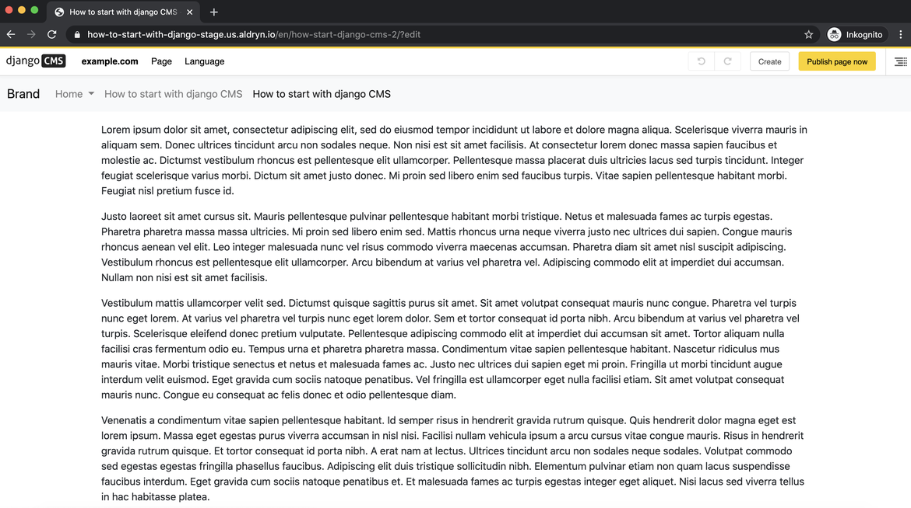
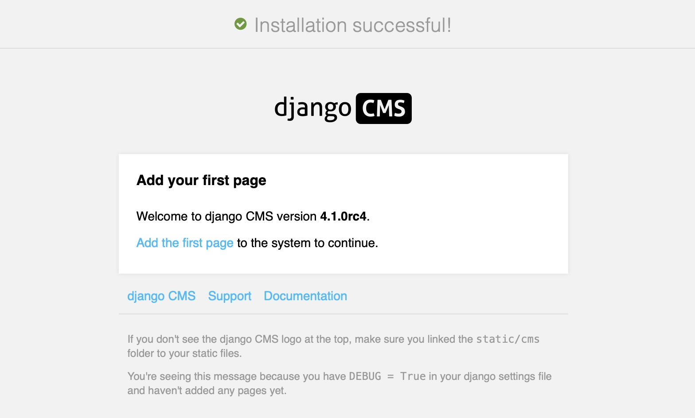

:sequential_nav: next

.. _install-django-cms-tutorial:

Installing django CMS
=====================

The setup is incredibly simple, and in this django CMS tutorial, we’ll take you through
the first five steps to help get you started.

What you need to get started
----------------------------

First of all, you don’t need to be a senior developer or have prior experience as a
developer with Django or Python to create your first django CMS demo website. In fact,
one of the added benefits of django CMS is that it offers a powerful yet easy to use
interface for most common tasks of setting up a web site. You can focus on any specific
needs of your project.

Before we begin the django CMS tutorial, you will need to know that there are several
ways to install django CMS for free.

1. You can either set up a project on `Divio Cloud <https://www.divio.com>`_, which is
   fast and useful for people without a technical background and a good starting point
   to experience the CMS User Interface.
2. As another option, you can set up the project `using docker
   <https://www.django-cms.org/en/blog/2021/01/19/how-you-spin-up-a-django-cms-project-in-less-than-5-minutes/>`_.
   It is a good way for a developer locally without an external vendor and we use this
   option in this django CMS demo.
3. The last option is to install is creating a django CMS project manually into a local
   virtual environment by running the ``djangocms`` command. This will create a new
   Django project set up for running django CMS based on a django CMS-specific project
   template. See :ref:`Installing django CMS by hand <install-django-cms-by-hand>` for
   details. This option is a good way for developers that want to install everything by
   hand to understand better, have full control, or want to add to an existing Django
   project.

In this tutorial we will cover both options 2 and 3, including the explanation what
exactly needs to happen when you add django CMS to a Django project.

.. _install-with-quickstarter:

Production-ready: django CMS quickstart
---------------------------------------

The django CMS quickstart project is a template for a Docker-based production-ready
setup. Especially if you know your way around Docker, you will be able to quickly set up
a project that is ready for deployment.

If you just want to test a project locally without Docker, you can :ref:`install django
CMS by hand in a few steps <install-django-cms-by-hand>`.

Setup Docker (Step 1)
~~~~~~~~~~~~~~~~~~~~~

Install docker from `here <https://docs.docker.com/get-docker/>`_. If you have not used
docker in the past, please read `this introduction on docker
<https://docs.docker.com/get-started/>`_.

Run the demo project in docker (Step 2)
~~~~~~~~~~~~~~~~~~~~~~~~~~~~~~~~~~~~~~~

Info: The `demo project
<https://github.com/django-cms/django-cms-quickstart/tree/support/cms-4.1.x>`_ is a
minimal Django project with some additional requirements in the ``requirements.txt``.

For more details see its Open the terminal application on your computer and go to a safe
folder (i.e. ``cd ~/Projects``), then

.. code-block:: bash

    git clone git@github.com:django-cms/django-cms-quickstart.git

    cd django-cms-quickstart
    docker compose build web
    docker compose up -d database_default
    docker compose run web python manage.py migrate
    docker compose run web python manage.py createsuperuser
    docker compose up -d

During the installation process, you will be prompted to enter your email address and
set a username and password. Open your browser and insert
``http://localhost:8000/admin`` there you should be invited to login and continue with
Step 3: create your first page

Create your first page (Step 3)
~~~~~~~~~~~~~~~~~~~~~~~~~~~~~~~

- Once you login you can press Create on the top right.
- Then you will see a pop-up window where the “New page” is marked blue.
- Press New Page and select Next.

.. image:: /introduction/images/create_page_with_django_cms1.png
    :alt: create a page with django cms
    :width: 400
    :align: center

After selecting Next, you will add in your title and some basic text content for the new
page, click Create.

.. image:: /introduction/images/create_page_with_django_cms2.png
    :alt: create a page with django cms
    :width: 400
    :align: center

Here is your newly created page.

Publish your first page (Step 4)
~~~~~~~~~~~~~~~~~~~~~~~~~~~~~~~~

The page we just created is just a draft and needs to be published once you finish. As
an editor, only you can see and edit your drafts, other visitors to your site will only
see your published pages.

Press "Publish"

To edit the page, you can switch back into editing mode using the "Edit" button, and
return to the published version of the page using the "view published" button.

In the editing mode, you can double-click on the paragraph of the text to change it, add
formatting, and save it again. Any changes that are made after publishing are saved to a
draft and will not be visible until you re-publish.

Congratulations, you now have installed django CMS and created your first page.

If you need to log in at any time, append ``?toolbar_on`` to the URL and hit Return.
This will enable the toolbar, from where you can log in and manage your website.

.. _install-django-cms-by-hand:

Installing django CMS by hand
-----------------------------

If you are looking for a typical installation using Docker look at the
:ref:`quickstarter section of this documentation <install-with-quickstarter>`.

If you prefer to do things manually, this how-to guide will take you through the
process. It is simple, quick, and transparent. If you know Django, you will recognize
how django CMS is set up like a typical Django project.

.. note::

    You can also use this guide to help you install django CMS as part of an existing
    project. However, the guide assumes that you are starting with a blank project, so
    you will need to adapt the steps below appropriately as required. You

This document assumes you have some basic familiarity with Python and Django. After
you've integrated django CMS into your project, you should be able to follow the
:doc:`/introduction/index` for an introduction to developing with django CMS.

Install the django CMS package (Step 1)
~~~~~~~~~~~~~~~~~~~~~~~~~~~~~~~~~~~~~~~

Check the :ref:`Python/Django requirements <requirements>` for this version of django
CMS.

django CMS also has other requirements, which it lists as dependencies in its
``setup.py``.

.. important::

    We strongly recommend doing all of the following steps in a `virtual environment
    <https://docs.python.org/3/library/venv.html>`_. You ought to know how to create,
    activate and dispose of virtual environments. If you don't, you can use the steps
    below to get started, but you are advised to take a few minutes to learn the basics
    of using virtual environments before proceeding further.

    .. code-block:: bash

        python3 -m venv .venv  # create a virtualenv
        source .venv/bin/activate  # activate it
        pip install --upgrade pip  # Upgrade pip

Then:

.. code-block::

    pip install django-cms

to install the release candidate version of django CMS. It will also install its
dependencies including Django.

Create a new django CMS project (Step 2)
~~~~~~~~~~~~~~~~~~~~~~~~~~~~~~~~~~~~~~~~

Create a new django CMS project:

.. code-block::

    djangocms myproject

This is a shortcut command for creating a new Django project with the right project
template. It performs the following five steps in one simple go:

1. It creates a new Django project:

   .. code-block::

       django-admin startproject myproject --template https://github.com/django-cms/cms-template/archive/4.1.tar.gz

   If ``django-admin startproject`` is new to you, you ought to read the `official
   Django tutorial <https://docs.djangoproject.com/en/dev/intro/tutorial01/>`_, which
   covers starting a new project.

2. It installs additional optional packages which are used in the template project.
   Those are

   - `djangocms-text-ckeditor <https://github.com/django-cms/djangocms-text-ckeditor>`_
     for rich text input.
   - `djangocms-frontend <https://github.com/django-cms/djangocms-frontend>`_ for
     `Bootstrap5 <https://getbootstrap.com>`_ support.
   - `django-filer <https://github.com/django-cms/django-filer>`_ for managing media
     files like images.
   - `djangocms-versioning <https://github.com/django-cms/djangocms-versioning>`_ for
     publishing and version management,
   - `djangocms-alias <https://github.com/django-cms/djangocms-alias>`_ for managing
     common content parts such as footers.
   - `djangocms_admin_style <https://github.com/django-cms/djangocms-admin-style>`_ for
     a consistent user experience with django CMS and Django admin.

3. It changes into the project directory and runs the ``migrate`` command to create the
   database:

   .. code-block::

       python -m manage migrate

4. It prompts for creating a superuser by invoking:

   .. code-block::

       python -m manage createsuperuser

5. It runs the django CMS check command to verify the installation is consistent:

   .. code-block::

       python -m manage cms check

Your new project will look like this:

.. code-block::

    myproject/
        LICENSE
        README.md
        db.sqlite3
        myproject/
            static/
            templates/
                base.html
            __init__.py
            asgi.py
            settings.py
            urls.py
            wsgi.py
        manage.py
        requirements.in

The ``LICENSE`` and ``README.md`` files are not needed and can be deleted or replaced by
appropriate files for your project.

``requirements.in`` contains dependencies for the project. Add your dependencies here.
We suggest to use pip-compile to freeze your requirements as, for example, discussed in
`this blog post
<https://blog.typodrive.com/2020/02/04/always-freeze-requirements-with-pip-compile-to-avoid-unpleasant-surprises/>`_.

Spin up your Django development server (Step 3)
~~~~~~~~~~~~~~~~~~~~~~~~~~~~~~~~~~~~~~~~~~~~~~~

Now you are ready to spin up Django's development server by first changing directory into
the project folder and then spinning up the development server:

.. code-block::

    cd myproject
    python -m manage runserver

You can visit your project's web site by pointing your browser to ``localhost:8000``.

Use the newly created superuser's credentials to authenticate and create your first
page!

Adding django CMS to an existing Django project
-----------------------------------------------

django CMS is nothing more than a powerful set of Django apps. Hence you can add django
CMS to any Django project. It will require some settings to be modified, however.

Minimally-required applications and settings
~~~~~~~~~~~~~~~~~~~~~~~~~~~~~~~~~~~~~~~~~~~~

To run django CMS you will only need to modify the ``settings.py`` and ``urls.py``
files.

Open the new project's ``settings.py`` file in your text editor.

INSTALLED_APPS
++++++++++++++

You will need to add the following to its list of ``INSTALLED_APPS``:

.. code-block::

    "django.contrib.sites",
    "cms",
    "menus",
    "treebeard",

- django CMS needs to use Django's :mod:`django:django.contrib.sites` framework. You'll
  need to set a ``SITE_ID`` in the settings - ``SITE_ID = 1`` will suffice.
- ``cms`` and ``menus`` are the core django CMS modules.
- `django-treebeard <http://django-treebeard.readthedocs.io>`_ is used to manage django
  CMS's page tree structures.

django CMS also installs `django CMS admin style
<https://github.com/django-cms/djangocms-admin-style>`_. This provides some styling that
helps make django CMS administration components easier to work with. Technically it's an
optional component and does not need to be enabled in your project, but it's strongly
recommended for a more consistent user experience.

In the ``INSTALLED_APPS``, **before** ``django.contrib.admin``, add:

.. code-block::

    "djangocms_admin_style",

Language settings
+++++++++++++++++

django CMS requires you to set the :setting:`django:LANGUAGES` setting. This should list all
the languages you want your project to serve, and must include the language in
:setting:`django:LANGUAGE_CODE`.

For example:

.. code-block::

    LANGUAGES = [
        ("en", "English"),
        ("de", "German"),
        ("it", "Italian"),
    ]
    LANGUAGE_CODE = "en"

(For simplicity's sake, at this stage it is worth changing the default ``en-us`` in that
you'll find in the ``LANGUAGE_CODE`` setting to ``en``.)

Database
++++++++

django CMS like most Django projects requires a relational database backend. Each django
CMS installation should have its own database.

You can use SQLite, which is included in Python and doesn't need to be installed
separately or configured further. You are unlikely to be using that for a project in
production, but it's ideal for development and exploration, especially as it is
configured by default in a new Django project's :setting:`django:DATABASES`.

.. note::

    For deployment, you'll need to use a :doc:`production-ready database with Django
    <django:ref/databases>`. We recommend using PostgreSQL_, MySQL_ or MariaDB_.

    Installing and maintaining database systems is far beyond the scope of this
    documentation, but is very well documented on the systems' respective websites.

    .. _mariadb: http://www.mariadb.com

    .. _mysql: http://www.mysql.com

    .. _postgresql: http://www.postgresql.org/

    Whichever database you use, it will also require the appropriate Python adaptor to
    be installed:

    .. code-block::

        pip install psycopg2     # for Postgres
        pip install mysqlclient  # for MySQL or MariaDB

    Refer to :setting:`Django's DATABASES setting documentation <django:DATABASES>` for the
    appropriate configuration for your chosen database backend.

Confirming that you are not migrating a version 3 project
+++++++++++++++++++++++++++++++++++++++++++++++++++++++++

Add to ``settings.py``:

.. code-block::

    CMS_CONFIRM_VERSION4 = True

This is to ensure that you do not accidentally run migrations on a django CMS version 3
database. This can lead to corruption since the data structures for the ``CMSPlugin``
models are different.

.. warning::

    Do not add ``CMS_CONFIRM_VERSION4 = True`` to your django CMS version 3 project
    unless you know what you are doing. Just running migrations can lead to data loss.

.. warning::

    To migrate a django CMS version 3 project to version 4 you can have a look at
    `django CMS 4 migration <https://github.com/Aiky30/djangocms-4-migration>`_. This is
    a third party project supposed to assist the migration from v3 to v4. It is not
    (yet) officially supported.

Database tables
+++++++++++++++

Now run migrations to create database tables for the new applications:

.. code-block::

    python manage.py migrate

Sekizai
~~~~~~~

`Django Sekizai <https://github.com/ojii/django-sekizai>`_ is required by the CMS for
static files management. You need to have:

.. code-block::

    "sekizai"

listed in ``INSTALLED_APPS``, and:

.. code-block::

    "sekizai.context_processors.sekizai"

in the ``TEMPLATES['OPTIONS']['context_processors']``:

.. code-block:: python
    :emphasize-lines: 7

    TEMPLATES = [
        {
            ...
            "OPTIONS": {
                "context_processors": [
                    ...
                    "django.template.context_processors.i18n",
                    "sekizai.context_processors.sekizai",
                ],
            },
        },
    ]

Middleware
~~~~~~~~~~

in your :setting:`django:MIDDLEWARE` you'll need
:class:`django:django.middleware.locale.LocaleMiddleware` - it's **not** installed in
Django projects by default.

Also add:

.. code-block::

    "django:django.middleware.locale.LocaleMiddleware",  # not installed by default

    "cms.middleware.user.CurrentUserMiddleware",
    "cms.middleware.page.CurrentPageMiddleware",
    "cms.middleware.toolbar.ToolbarMiddleware",
    "cms.middleware.language.LanguageCookieMiddleware",

to the list.

You can also add ``'cms.middleware.utils.ApphookReloadMiddleware'``. It's not absolutely
necessary, but it's :ref:`useful <reloading_apphooks>`. If included, should be at the
start of the list.

add the following configuration to your ``settings.py``:

.. code-block::

    X_FRAME_OPTIONS = "SAMEORIGIN"

Context processors
~~~~~~~~~~~~~~~~~~

Add ``"cms.context_processors.cms_settings"`` to
``TEMPLATES['OPTIONS']['context_processors']``.

Also add ``'django.template.context_processors.i18n'`` if it's not already present.

``cms check`` should now be unable to identify any further issues with your project.
Some additional configuration is required however.

Further required configuration
------------------------------

URLs
~~~~

In the project's ``urls.py``, add ``path("", include("cms.urls"))`` to the
``urlpatterns`` list, preferably as ``i18patterns``. It should come after other
patterns, so that specific URLs for other applications can be detected first.

You'll also need to have an import for ``django.urls.include``. For example:

.. code-block:: python
    :emphasize-lines: 1,5

    from django.conf.urls.i18n import i18n_patterns
    from django.urls import include, path

    urlpatterns = i18patterns(
        path("admin/", admin.site.urls),
        path("", include("cms.urls")),
    )

The django CMS project will now run, as you'll see if you launch it with ``python
manage.py runserver``. You'll be able to reach it at http://localhost:8000/, and the
admin at http://localhost:8000/admin/. You won't yet actually be able to do anything
very useful with it though.

Versioning and Aliases
++++++++++++++++++++++

Compared to previous versions of django CMS, the core django CMS since version 4 has
been stripped of some functionality to allow for better implementations. The two most
important examples are the now separate apps django CMS versioning and django CMS alias.
We highly recommend installing them both:

.. code-block::

    pip install djangocms-versioning
    pip install djangocms-alias

Also add them to ``INSTALLED_APPS``:

.. code-block::

    "djangocms_versioning",
    "djangocms_alias",

.. _basic_template:

Templates
+++++++++

django CMS requires at least one template for its pages, so you'll need to add
:setting:`CMS_TEMPLATES` to your settings. The first template in the :setting:`CMS_TEMPLATES`
list will be the project's default template.

.. code-block::

    CMS_TEMPLATES = [
        ('home.html', 'Home page template'),
    ]

In the root of the project, create a ``templates`` directory, and in that,
``home.html``, a minimal django CMS template:

.. code-block:: html+django

    
    <html>
        <head>
            <title></title>
            
        </head>
        <body>
            
            
            
        </body>
    </html>

This is worth explaining in a little detail:

- ```` loads the template tag libraries we use in the
  template.
- ```` extracts the page's ``page_title``
  :ref:`attribute <page_attribute>`.
- ```` and ```` are Sekizai template tags
  that load blocks of HTML defined by Django applications. django CMS defines blocks for
  CSS and JavaScript, and requires these two tags. We recommended placing ```` just before the ``</head>`` tag, and and ```` tag just before the ``</body>``.
- ```` renders the :ttag:`django CMS toolbar <cms_toolbar>`.
- ```` defines a :ttag:`placeholder`, where plugins can be
  inserted. A template needs at least one ```` template tag to be
  useful for django CMS. The name of the placeholder is simply a descriptive one, for
  your reference.

Django needs to be know where to look for its templates, so add ``templates`` to the
``TEMPLATES['DIRS']`` list:

.. code-block:: python
    :emphasize-lines: 4

    TEMPLATES = [
        {
            ...
            'DIRS': ['templates'],
            ...
        },
    ]

.. note::

    The way we have set up the template here is just for illustration. In a real
    project, we'd recommend creating a ``base.html`` template, shared by all the
    applications in the project, that your django CMS templates can extend.

    See Django's :ref:`template language documentation <django:template-inheritance>`
    for more on how template inheritance works.

Media and static file handling
++++++++++++++++++++++++++++++

A django CMS site will need to handle:

- *static files*, that are a core part of an application or project, such as its
  necessary images, CSS or JavaScript
- *media files*, that are uploaded by the site's users or applications.

:setting:`django:STATIC_URL` is defined (as ``"/static/"``) in a new project's settings by
default. :setting:`django:STATIC_ROOT`, the location that static files will be copied to and
served from, is not required for development - :doc:`only for production
<django:howto/deployment/checklist>`.

For now, using the runserver and with ``DEBUG = True`` in your settings, you don't need
to worry about either of these.

However, :setting:`django:MEDIA_URL` (where media files will be served) and
:setting:`django:MEDIA_ROOT` (where they will be stored) need to be added to your settings:

.. code-block::

    MEDIA_URL = "/media/"
    MEDIA_ROOT = os.path.join(BASE_DIR, "media")

For deployment, you need to configure suitable media file serving. **For development
purposes only**, the following will work in your ``urls.py``:

.. code-block:: python
    :emphasize-lines: 1,2,6

    from django.conf import settings
    from django.conf.urls.static import static

    urlpatterns = [...] + static(settings.MEDIA_URL, document_root=settings.MEDIA_ROOT)

(See the Django documentation for guidance on :doc:`serving media files in production
<django:howto/static-files/index>`.)

Using ``cms check`` for configuration
~~~~~~~~~~~~~~~~~~~~~~~~~~~~~~~~~~~~~

Once you have completed the minimum required set-up described above, you can use django
CMS's built-in ``cms check`` command to help you identify and install other components.
Run:

.. code-block::

    python manage.py cms check

This will check your configuration, your applications and your database, and report on
any problems.

.. note::

    If key components are be missing, django CMS will be unable to run the ``cms check
    command`` and will simply raise an error instead.

After each of the steps below run ``cms check`` to verify that you have resolved that
item in its checklist.

Adding content-handling functionality
~~~~~~~~~~~~~~~~~~~~~~~~~~~~~~~~~~~~~

You now have the basics set up for a django CMS site, which is able to manage and serve
up pages. However the project so far has no plugins installed, which means it has no way
of handling content in those pages. All content in django CMS is managed via plugins.
So, we now need to install some additional addon applications to provide plugins and
other functionality.

You don't actually **need** to install any of these. django CMS doesn't commit you to
any particular applications for content handling. The ones listed here however provide
key functionality and are strongly recommended.

Django Filer
++++++++++++

`Django Filer`_ provides file and image management. Many other applications also rely on
Django Filer - it's very unusual to have a django CMS site that does *not* run Django
Filer. The configuration in this section will get you started, but you should refer to
the `Django Filer documentation <https://django-filer.readthedocs.io>`_ for more
comprehensive configuration information.

.. _django filer: https://github.com/django-cms/django-filer

To install:

.. code-block::

    pip install django-filer\>=3.0

A number of applications will be installed as dependencies. `Easy Thumbnails
<https://github.com/SmileyChris/easy-thumbnails>`_ is required to create new versions of
images in different sizes; `Django MPTT <https://github.com/django-mptt/django-mptt/>`_
manages the tree structure of the folders in Django Filer.

Pillow, the Python imaging library, will be installed. `Pillow
<https://github.com/python-pillow/Pillow>`_ needs some system-level libraries - the
`Pillow documentation <https://pillow.readthedocs.io>`_ describes in detail what is
required to get this running on various operating systems.

Add:

.. code-block::

    'filer',
    'easy_thumbnails',

to ``INSTALLED_APPS``.

You also need to add:

.. code-block::

    THUMBNAIL_HIGH_RESOLUTION = True

    THUMBNAIL_PROCESSORS = (
        'easy_thumbnails.processors.colorspace',
        'easy_thumbnails.processors.autocrop',
        'filer.thumbnail_processors.scale_and_crop_with_subject_location',
        'easy_thumbnails.processors.filters'
    )

New database tables will need to be created for Django Filer and Easy Thumbnails, so run
migrations:

.. code-block::

    python manage.py migrate filer
    python manage.py migrate easy_thumbnails

(or simply, ``python manage.py migrate``).

Django CMS CKEditor
+++++++++++++++++++

`Django CMS CKEditor`_ is the default rich text editor for django CMS.

.. _django cms ckeditor: https://github.com/django-cms/djangocms-text-ckeditor

Install: ``pip install djangocms-text-ckeditor``.

Add ``djangocms_text_ckeditor`` to your ``INSTALLED_APPS``.

Run migrations:

.. code-block::

    python manage.py migrate djangocms_text_ckeditor

Django CMS Frontend
+++++++++++++++++++

`Djangto CMS Frontend`_ adds support for css frameworks to django CMS. By default, it
comes with support of the Bootstrap 5 framework. However, you can use it to create your
own theme using your own framework.

.. _djangto cms frontend: https://github.com/django-cms/djangocms-frontend

Install: ``pip install djangocms-frontend`` and it and its subpackages to
``INSTALLED_APPS``:

.. code-block::

    INSTALLED_APPS = [
        ...,
        "easy_thumbnails',
        "djangocms_frontend',
        "djangocms_frontend.contrib.accordion",
        "djangocms_frontend.contrib.alert",
        "djangocms_frontend.contrib.badge",
        "djangocms_frontend.contrib.card",
        "djangocms_frontend.contrib.carousel",
        "djangocms_frontend.contrib.collapse",
        "djangocms_frontend.contrib.content",
        "djangocms_frontend.contrib.grid",
        "djangocms_frontend.contrib.image",
        "djangocms_frontend.contrib.jumbotron",
        "djangocms_frontend.contrib.link",
        "djangocms_frontend.contrib.listgroup",
        "djangocms_frontend.contrib.media",
        "djangocms_frontend.contrib.tabs",
        "djangocms_frontend.contrib.utilities",
        ...,
    ]

Miscellaneous plugins
+++++++++++++++++++++

There are plugins for django CMS that cover a vast range of functionality. To get
started, it's useful to be able to rely on a set of well-maintained plugins that cover
some general content management needs.

- `djangocms-file <https://github.com/django-cms/djangocms-file>`_
- `djangocms-picture <https://github.com/django-cms/djangocms-picture>`_
- `djangocms-video <https://github.com/django-cms/djangocms-video>`_
- `djangocms-googlemap <https://github.com/django-cms/djangocms-googlemap>`_
- `djangocms-snippet <https://github.com/django-cms/djangocms-snippet>`_
- `djangocms-style <https://github.com/django-cms/djangocms-style>`_

To install:

.. code-block::

    pip install djangocms-file djangocms-picture djangocms-video djangocms-googlemap djangocms-snippet djangocms-style

and add:

.. code-block::

    "djangocms_file",
    "djangocms_picture",
    "djangocms_video",
    "djangocms_googlemap",
    "djangocms_snippet",
    "djangocms_style",

to ``INSTALLED_APPS``.

Then run migrations:

.. code-block::

    python manage.py migrate

These and other plugins are described in more detail in :ref:`commonly-used-plugins`.

Next steps
----------

If this is your first django CMS project, read through the
`user guide <https://user-guide.django-cms.org>`_  for a walk-through of some basics.

The :ref:`tutorials for developers <tutorials>` will help you understand how to approach
django CMS as a developer. Note that the tutorials assume you have installed the CMS
using the django CMS quickstart project, but with a little adaptation you'll be able to
use it as a basis.

To deploy your django CMS project on a production web server, please refer to the
:doc:`Django deployment documentation <django:howto/deployment/index>`.
