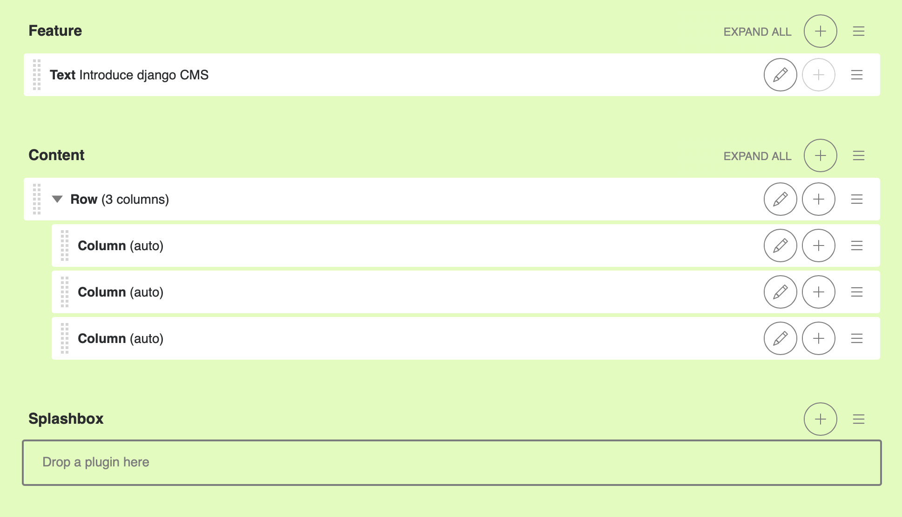

:sequential_nav: both

########################
Templates & Placeholders
########################

In this tutorial we'll introduce Placeholders, and we're also going to show how
you can make your own HTML templates CMS-ready.

*********
Templates
*********

You can use HTML templates to customise the look of your website, define
Placeholders to mark sections for managed content and use special tags to
generate menus and more.

You can define multiple templates, with different layouts or built-in
components, and choose them for each page as required. A page's template
can be switched for another at any time.

You'll find the site's templates in ``django-cms-quickstart/backend/templates``.

By default, pages in your site will use the ``fullwidth.html`` template, the first one listed in
the project's ``settings.py`` ``CMS_TEMPLATES`` tuple:

..  code-block:: python
    :emphasize-lines: 6

    CMS_TEMPLATES = [
        # a minimal template to get started with
        ('minimal.html', 'Minimal template'),

        # optional templates that extend base.html, to be used with Bootstrap 5
        ('bootstrap5.html', 'Bootstrap 5 Demo'),

        ('whitenoise-static-files-demo.html', 'Static File Demo'),
    ]

************
Placeholders
************

Placeholders are an easy way to define sections in an HTML template that will
be filled with content from the database when the page is rendered. This
content is edited using django CMS's frontend editing mechanism, using Django
template tags.

``fullwidth.html`` contains a single placeholder, ````.

You'll also see ```` in that file - ``cms_tags`` is the
required template tag library.

If you're not already familiar with Django template tags, you can find out more in the `Django documentation
<https://docs.djangoproject.com/en/dev/topics/templates/>`_.

Add a couple of new placeholders to ``fullwidth.html``, ```` and ```` inside the ```` section. For example:

.. code-block:: html+django
   :emphasize-lines: 2,4

    
        
        
        
    

If you switch to *Structure* mode (*button in the upper-right corner of the page*), you'll see the new placeholders available for use.

**************
Static Aliases
**************

The content of the placeholders we've encountered so far is different for every page. Sometimes though you'll want to have a section on your website which should be the same on every single page, such as a footer block.

You *could* hard-code your footer into the template, but it would be nicer to be able to manage it through the CMS. This is what **static aliases** are for. You need to install the django CMS alias package to use static aliases::

    pip install djangocms-alias

Do not forget to add ``djangocms_alias`` to your ``INSTALLED_APPS`` in ``settings.py``.

Static aliases are an easy way to display the same content on multiple locations on your website. Static placeholders act almost like normal placeholders, except for the fact that once a static placeholder is created and you added content to it, it will be saved globally. Even when you remove the static placeholders from a template, you can reuse them later.

So let's add a footer to all our pages. Since we want our footer on every single page, we should add it to our **base template** (``mysite/templates/base.html``). Place it near the end of the HTML ``<body>`` element, and inside a content block:

.. code-block:: html+django
   :emphasize-lines: 1,3-5

        

        
            <footer>
              
            </footer>
        

        
    </body>

Save the template and return to your browser. Refresh any page in Structure mode, then go to the "Aliases.." entry in the site menu and you'll see the new static alias listed in its category "Static alias".

.. image:: images/static-alias.png
   :alt: a static placeholder
   :align: center

..  note::

    Like editing of pages and aliases publishing is independent.

If you add some content to the new static placeholder in the usual way, you'll see that it appears on your site's other pages too.

***************
Rendering Menus
***************

In order to render the CMS's menu in your template you can use the :doc:`show_menu
</reference/navigation>` tag.

Any template that uses ``show_menu`` must load the CMS's ``menu_tags`` library
first:

.. code-block:: html+django

    

The menu we use in ``mysite/templates/base.html`` is:

.. code-block:: html+django

    <ul class="nav">
        
    </ul>

The options control the levels of the site hierarchy that are displayed in the menu tree - but you don't need to worry about exactly what they do at this stage.

Next we'll look at :ref:`integrating_applications`.
