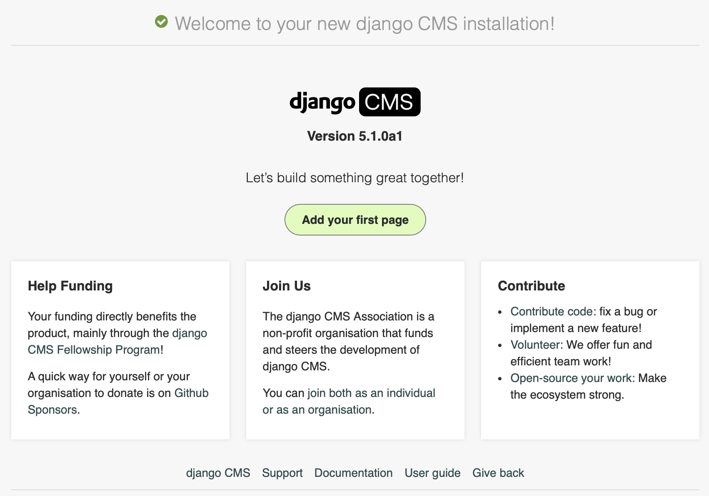

:sequential_nav: next

.. _tutorial_install:

Installing django CMS
=====================

This is a short setup chapter. Its only goal is to get you to a running
``python -m manage runserver`` with the CMS welcome screen visible at
``http://localhost:8000/``. Everything after this is the real tutorial.

Prerequisites
-------------

You need:

- **Python** ≥ 3.10 and ``pip`` working from your shell.
- **Django** familiarity at the level of the
  `Django tutorial <https://docs.djangoproject.com/en/stable/intro/tutorial01/>`_
  — settings files, ``manage.py``, apps, templates.
- A text editor and a terminal.

You do **not** need: prior django CMS experience, a database server, or
any frontend tooling. The tutorial uses SQLite.

Install django CMS
------------------

Open a terminal and run:

.. code-block:: bash

    python3 -m venv .venv
    source .venv/bin/activate  # On Windows: .venv\Scripts\activate
    pip install django-cms
    djangocms coffeesite

The ``djangocms`` command is a shortcut that creates a fully wired
django CMS project. Behind the scenes it:

1. Runs ``django-admin startproject coffeesite`` with the official
   `cms-template <https://github.com/django-cms/cms-template>`_
   project template.
2. Installs the packages the template depends on:
   `djangocms-text <https://github.com/django-cms/djangocms-text>`_
   (rich-text editor),
   `djangocms-frontend <https://github.com/django-cms/djangocms-frontend>`_
   (Bootstrap 5 support),
   `django-filer <https://github.com/django-cms/django-filer>`_
   (media files),
   `djangocms-versioning <https://github.com/django-cms/djangocms-versioning>`_
   (draft / published versions),
   `djangocms-alias <https://github.com/django-cms/djangocms-alias>`_
   (reusable content blocks),
   `djangocms-simple-admin-style <https://github.com/fsbraun/djangocms-simple-admin-style>`_
   (admin theming).
3. Runs ``python -m manage migrate`` to create the SQLite database.
4. Prompts you to create a superuser.
5. Runs ``python -m manage cms check`` to verify the install.

The tutorial uses the project name ``coffeesite``. If you pick a
different name, substitute it everywhere you see ``coffeesite`` below.

Run the development server
--------------------------

.. code-block:: bash

    cd coffeesite
    python -m manage runserver

Open ``http://localhost:8000/`` in your browser. You should see the
django CMS welcome page with the toolbar across the top. Log in with
the superuser credentials you created during the install.

Your project layout
-------------------

The ``coffeesite/`` directory now contains a working Django project:

.. code-block:: text

    coffeesite/
        LICENSE
        README.md
        db.sqlite3
        coffeesite/
            static/
            templates/
                base.html
            __init__.py
            asgi.py
            settings.py
            urls.py
            wsgi.py
        manage.py
        requirements.in

You can delete or replace ``LICENSE`` and ``README.md`` for your own
project. ``requirements.in`` is where you add new dependencies — we
will add one in chapter 3.

The tutorial assumes:

- the project package is called ``coffeesite``,
- a Django app called ``coffeeshop`` that you will create in
  chapter 3,
- ``DEBUG = True`` while you work.

Want to install by hand?
------------------------

If you'd rather see every line of settings that the ``djangocms``
shortcut writes for you, work through
:doc:`/how_to/23-manual-installation` ("Install django CMS manually")
instead. You will arrive at the same place; the rest of this tutorial
works identically with either install path.

In the next chapter you will create your first CMS page.
