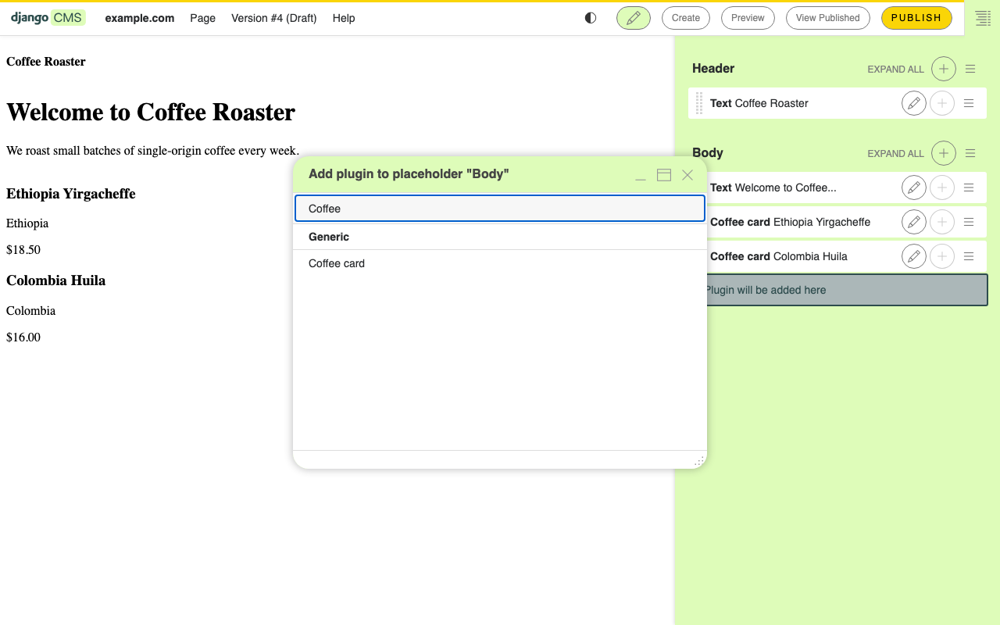
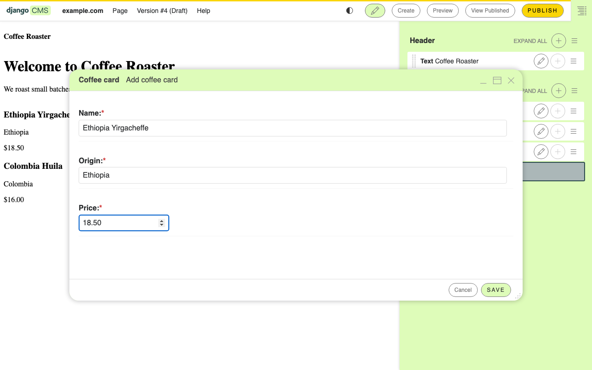

:sequential_nav: both

.. _tutorial_plugin:

A custom plugin
===============

django CMS does not come with built-in plugins. We have been using plugins 
(Text, Image, etc.) provided by packages such as djangocms-text or 
djangocms-frontend. Standardized plugins only get you so far. In this
chapter you will create a *Coffee card* plugin: a small reusable
component editors can drop into any placeholder to show one of your
coffees, with a name, an origin, and a price.

Goal
----

At the end of this chapter, the **Add plugin** menu in the toolbar
contains a *Coffee card* entry. Choosing it opens a form with three
fields. Saving renders a styled card in the placeholder.

1. Create the ``coffeeshop`` app
--------------------------------

In your project root:

.. code-block:: bash

    python manage.py startapp coffeeshop

Add it to ``INSTALLED_APPS`` in ``settings.py``:

.. code-block:: python

    INSTALLED_APPS = [
        # ... existing apps ...
        "coffeeshop",
    ]

2. Define the plugin model
--------------------------

Plugin data is stored in the database. Django CMS plugin models inherit
from :class:`~cms.models.pluginmodel.CMSPlugin`, **not** from
``models.Model``.

Open ``coffeeshop/models.py`` and replace its contents with:

.. code-block:: python

    from cms.models import CMSPlugin
    from django.db import models

    class CoffeeCard(CMSPlugin):
        name = models.CharField(max_length=80)
        origin = models.CharField(max_length=80)
        price = models.DecimalField(max_digits=6, decimal_places=2)

        def __str__(self):
            return self.name

Create and run the migration:

.. code-block:: bash

    python manage.py makemigrations coffeeshop
    python manage.py migrate coffeeshop

3. Register the plugin class
----------------------------

The model holds the data. A separate *plugin class* tells the CMS how
to render it and what label to show in the menu. Plugin classes live in
``cms_plugins.py``.

Create ``coffeeshop/cms_plugins.py``:

.. code-block:: python

    from cms.plugin_base import CMSPluginBase
    from cms.plugin_pool import plugin_pool

    from coffeeshop.models import CoffeeCard

    @plugin_pool.register_plugin
    class CoffeeCardPlugin(CMSPluginBase):
        model = CoffeeCard
        name = "Coffee card"
        render_template = "coffeeshop/coffee_card.html"
        cache = True

        def render(self, context, instance, placeholder):
            context["instance"] = instance
            return context

4. Add the render template
--------------------------

Create ``coffeeshop/templates/coffeeshop/coffee_card.html``:

.. code-block:: html+django

    <article class="coffee-card">
        <h3>{{ instance.name }}</h3>
        
{{ instance.origin }}

        
${{ instance.price }}

    </article>

The ``instance`` in the template is the ``CoffeeCard`` row the editor
created.

5. Try it
---------

Restart ``runserver`` (necessary, because you added a new
``cms_plugins.py``).

In your browser, open the homepage in edit mode:

#. Click into the ``Body`` placeholder.
#. **Add plugin** → notice the new *Coffee card* entry.
#. Fill in a name (``Ethiopia Yirgacheffe``), an origin
   (``Ethiopia``), and a price (``18.50``). Save.
#. The card renders in place.

         to show the new Coffee card entry
   :align: center
   :width: 600

Choosing *Coffee card* opens the plugin's editing form. You did not
write this form — the CMS generated it from the three fields on your
``CoffeeCard`` model, the same way the Django admin builds forms from
a ``ModelAdmin``:

         filled in
   :align: center
   :width: 600

Drop a second card in. Drag to reorder. **Publish** the page when you
are happy.

         rendered coffee cards stacked in the Body placeholder
   :align: center
   :width: 600

You now have a custom component that any editor can reuse across the
site.

What just happened
------------------

A django CMS plugin is three small files:

1. A **model** that subclasses ``CMSPlugin`` — what data to store.
2. A **plugin class** registered with ``plugin_pool`` — what the
   editor sees, which template to render.
3. A **template** — what visitors see.

Every plugin in every django CMS site follows the same shape.

What we did **not** do — and where to find it when you need it:

- **Copying plugins across page versions** (``copy_relations``) — see
  :doc:`/how_to/09-custom_plugins`.
- **Plugins that contain other plugins** (allow_children) — see
  :doc:`/how_to/09-custom_plugins`.
- **Plugins with foreign keys to your own models** — same place.
- **The full plugin API surface** — see :doc:`/reference/plugins`.

Going further
-------------

- :doc:`/how_to/09-custom_plugins` — every advanced plugin pattern.
- :doc:`/explanation/plugins` — why the model/view/template split, and
  how plugins relate to placeholders.

In the next chapter we will leave plugins behind and mount an entire
Django app on a CMS page using an apphook.
