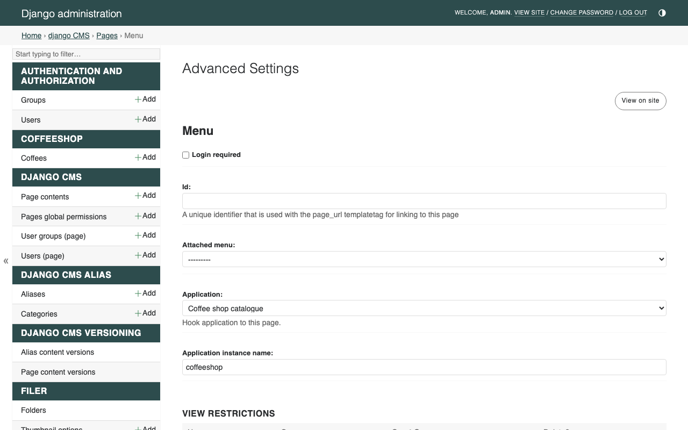
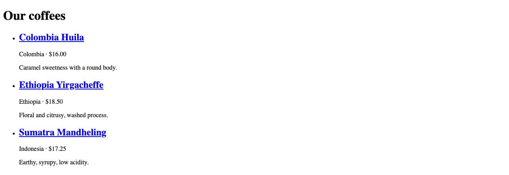

:sequential_nav: both

.. _tutorial_apphook:

Mount a Django app with an apphook
==================================

Plugins are for components dropped *into* pages. **Apphooks** are for
attaching an entire Django app *to* a page, so the URL of that page
becomes the entry point of the app.

In this chapter you will:

- add a ``Coffee`` model with list and detail views to the
  ``coffeeshop`` app,
- create an apphook that exposes those views,
- attach the apphook to a new CMS page at ``/menu/``.

Goal
----

At the end of this chapter, ``http://localhost:8000/menu/`` is served
by your ``coffeeshop`` views (not by a CMS placeholder), and each
coffee links to its own detail page below ``/menu/``. Editors can
move the page in the page tree like any other page, and the app moves
with it.

1. A catalogue model
--------------------

Add this to ``coffeeshop/models.py`` (keep the ``CoffeeCard`` plugin
model from the previous chapter):

.. code-block:: python

    class Coffee(models.Model):
        name = models.CharField(max_length=80)
        origin = models.CharField(max_length=80)
        price = models.DecimalField(max_digits=6, decimal_places=2)
        description = models.TextField(blank=True)

        class Meta:
            ordering = ("name",)

        def __str__(self):
            return self.name

Run the migration:

.. code-block:: bash

    python manage.py makemigrations coffeeshop
    python manage.py migrate coffeeshop

Register the model in ``coffeeshop/admin.py`` so you can add a few
rows:

.. code-block:: python

    from django.contrib import admin
    from coffeeshop.models import Coffee

    admin.site.register(Coffee)

Open ``/admin/`` and add three or four coffees.

2. A list view
--------------

Create ``coffeeshop/views.py``:

.. code-block:: python

    from django.views.generic import ListView
    from coffeeshop.models import Coffee

    class CoffeeListView(ListView):
        model = Coffee
        template_name = "coffeeshop/coffee_list.html"
        context_object_name = "coffees"

And its template at
``coffeeshop/templates/coffeeshop/coffee_list.html``:

.. code-block:: html+django

    

    
        <h1>Our coffees</h1>
        <ul class="coffee-list">
            
                <li>
                    <h2>{{ coffee.name }}</h2>
                    
{{ coffee.origin }} · ${{ coffee.price }}

                    
{{ coffee.description }}

                </li>
            
        </ul>
    

(If your ``base.html`` from chapter 2 has no ````,
add one wrapping the ```` line.)

A URL conf for the app at ``coffeeshop/urls.py``:

.. code-block:: python

    from django.urls import path
    from coffeeshop.views import CoffeeListView

    app_name = "coffeeshop"

    urlpatterns = [
        path("", CoffeeListView.as_view(), name="list"),
    ]

Do **not** add this to your project's main ``urls.py``. The apphook
will do that for us.

3. A detail view
----------------

Each coffee should get a page of its own. Add a ``DetailView`` next to
the list view in ``coffeeshop/views.py``:

.. code-block:: python

    from django.views.generic import DetailView, ListView
    from coffeeshop.models import Coffee

    class CoffeeListView(ListView):
        model = Coffee
        template_name = "coffeeshop/coffee_list.html"
        context_object_name = "coffees"

    class CoffeeDetailView(DetailView):
        model = Coffee
        template_name = "coffeeshop/coffee_detail.html"
        context_object_name = "coffee"

Create its template at
``coffeeshop/templates/coffeeshop/coffee_detail.html``:

.. code-block:: html+django

    

    
        <h1>{{ coffee.name }}</h1>
        
{{ coffee.origin }} · ${{ coffee.price }}

        
{{ coffee.description }}

        
<a href="">Back to all coffees</a>

    

Route it in ``coffeeshop/urls.py``:

.. code-block:: python

    from coffeeshop.views import CoffeeDetailView, CoffeeListView

    urlpatterns = [
        path("", CoffeeListView.as_view(), name="list"),
        path("<int:pk>/", CoffeeDetailView.as_view(), name="detail"),
    ]

Finally, make each coffee in the list link to its detail page. In
``coffeeshop/templates/coffeeshop/coffee_list.html``, change the name
line to:

.. code-block:: html+django

    <h2><a href="">{{ coffee.name }}</a></h2>

4. The apphook
--------------

Create ``coffeeshop/cms_apps.py``:

.. code-block:: python

    from cms.app_base import CMSApp
    from cms.apphook_pool import apphook_pool

    @apphook_pool.register
    class CoffeeshopApphook(CMSApp):
        app_name = "coffeeshop"
        name = "Coffee shop catalogue"

        def get_urls(self, page=None, language=None, **kwargs):
            return ["coffeeshop.urls"]

``app_name`` is the URL namespace the apphook installs into. Because
``coffeeshop/urls.py`` also declares ``app_name = "coffeeshop"`` and
gives the list view ``name="list"``, you can reverse it from anywhere
in the project as ```` — even though the
URL itself is decided by whichever CMS page you attach the apphook to.

Restart ``runserver`` (apphooks are loaded at startup).

.. tip::

   If you find yourself attaching, moving, or removing apphooks while
   you work, add ``cms.middleware.utils.ApphookReloadMiddleware`` at
   the **top** of ``MIDDLEWARE`` in ``settings.py``. The CMS then
   reloads the URL conf in-process when an apphook changes, and you no
   longer need to restart ``runserver`` for each edit. (The
   ``djangocms`` quickstart already includes it.)

5. Attach the apphook to a page
-------------------------------

In the toolbar:

#. **Create** → **New page**. Title: ``Menu``. Click **Create**.
#. **Page** → **Advanced settings…**
#. In the **Application** dropdown, choose *Coffee shop catalogue*.
#. Save.
#. **Publish** the page.

         in the Application dropdown
   :align: center
   :width: 600

Visit ``http://localhost:8000/menu/`` — you should see your coffee
list, rendered by ``CoffeeListView`` extending ``base.html``. Click a
coffee's name: its detail page is served at a URL like ``/menu/2/``,
below the page's URL.

         unstyled for now, that changes in the next chapter
   :align: center
   :width: 600

You can rename the page slug, move the page in the tree, or translate
it; the URL of the apphook follows the page.

What just happened
------------------

You attached a Django app to a CMS page. The CMS:

- finds the page that has the apphook,
- prepends that page's URL to your app's ``urlpatterns``,
- hands every request below that page to your views.

That is why URL changes in the toolbar move the app with them — and
why ``get_urls`` returns a whole URL conf rather than a single view:
the list *and* every detail page below it follow the page together.

.. important::

    Do not create CMS child pages *underneath* a page that has an
    apphook. The apphook owns every URL below it; child pages would
    never be reachable. The conceptual story is in
    :doc:`/explanation/apphooks`.

Going further
-------------

- :doc:`/how_to/11-apphooks` — apphooks with custom URL patterns,
  ``permissions``, and reloading without restarting.
- :doc:`/how_to/12-namespaced_apphooks` — multiple instances of the
  same apphook on different pages.
- :doc:`/reference/app_base` — the full ``CMSApp`` API.

One chapter left. We will give the site some style and a real
navigation.
