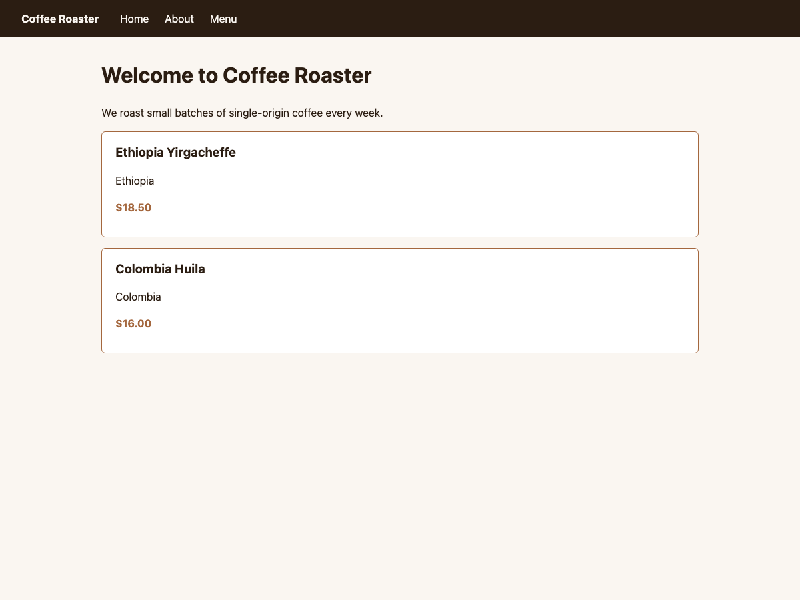
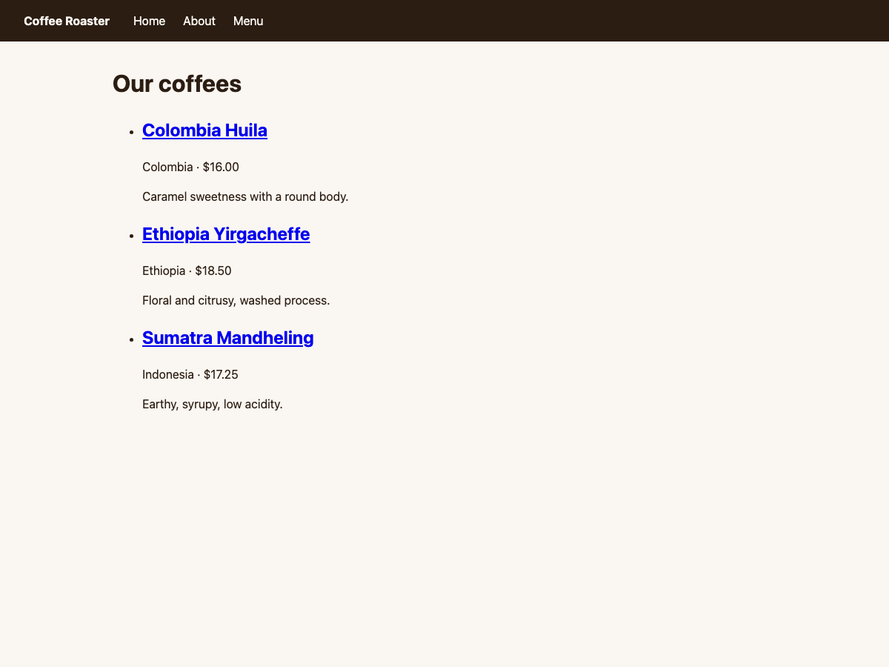

:sequential_nav: both

.. _tutorial_frontend:

Make it look like a site
========================

So far the site works but reads as an admin demo. In this short chapter
you will add a small stylesheet, render the CMS menu as a real top
navigation, and replace the unstyled body in ``base.html`` with a
proper layout.

Goal
----

At the end of this chapter, an anonymous visitor lands on a homepage
with a navigation bar containing **Home**, **About**, and **Menu**.
Pages share a visual style. The coffee cards look like cards.

1. A minimal stylesheet
-----------------------

Create ``coffeeshop/static/coffeeshop/site.css``:

.. code-block:: css

    :root {
        --ink: #2b1d12;
        --paper: #faf6f1;
        --accent: #a4673e;
    }

    body {
        font-family: system-ui, sans-serif;
        margin: 0;
        background: var(--paper);
        color: var(--ink);
        line-height: 1.5;
    }

    header.site-header {
        background: var(--ink);
        color: var(--paper);
        padding: 1rem 2rem;
        display: flex;
        align-items: center;
        gap: 2rem;
    }

    header.site-header a {
        color: inherit;
        text-decoration: none;
    }

    nav.site-nav ul {
        list-style: none;
        display: flex;
        gap: 1.5rem;
        margin: 0;
        padding: 0;
    }

    main {
        max-width: 56rem;
        margin: 2rem auto;
        padding: 0 1rem;
    }

    .coffee-card {
        border: 1px solid var(--accent);
        border-radius: 6px;
        padding: 1rem 1.25rem;
        margin: 1rem 0;
        background: white;
    }

    .coffee-card h3 {
        margin: 0 0 .25rem;
    }

    .coffee-card .price {
        font-weight: bold;
        color: var(--accent);
    }

You do not have to type this — copy any starter stylesheet you like.
The point is that styling is ordinary CSS.

Run ``python manage.py collectstatic --noinput`` if your project serves
static files via Django's staticfiles app. During development with
``DEBUG = True`` you usually do not need to.

2. Render the navigation from CMS pages
---------------------------------------

The CMS menu is a *template tag*. Edit ``coffeesite/templates/base.html``
to import it and use it inside the header.

.. code-block:: html+django
    :emphasize-lines: 1,7,13-18

    
    <!doctype html>
    <html lang="en">
    <head>
        <meta charset="utf-8">
        <title> – Coffee Roaster</title>
        <link rel="stylesheet" href="">
        
    </head>
    <body>
        

        <header class="site-header">
            <a href="/"><strong>Coffee Roaster</strong></a>
            <nav class="site-nav">
                <ul></ul>
            </nav>
        </header>

        <main>
            
                
            
        </main>

        
    </body>
    </html>

The four numbers on ```` control how deep and how many
levels the menu shows. Defaults are sane. The full list of menu tags
is in :doc:`/reference/navigation`.

The default ``menu/menu.html`` template renders ``<li>`` items — only
nested levels bring their own ``<ul>`` — so you provide the outer
``<ul>`` yourself, as in the snippet above. The CSS above styles the
top level into a horizontal bar.

3. Drop the placeholder ``Header``
----------------------------------

The navigation is now part of ``base.html`` itself, not a placeholder.
You can either delete the ```` line from
chapter 2 or leave it for future per-page banner content. For this
tutorial, delete it.

Restart ``runserver``. Refresh ``/`` in a private window. You should
see:

- a dark header with the site name and three menu items,
- styled coffee cards on the homepage,
- the catalogue at ``/menu/`` inheriting the same chrome.

         site name and horizontal nav, styled coffee cards below
   :align: center
   :width: 600

         catalogue inheriting the header and styling
   :align: center
   :width: 600

If the menu shows pages you wanted hidden, mark them as **not in
navigation** in **Page** → **Advanced settings** → *Menu*.

What just happened
------------------

Two CMS-specific pieces appeared:

- ```` reads the page tree and renders a navigation
  rooted at the start of it. Pages are added, removed, and reordered
  in the toolbar; the menu reflects it without any code change.
- The CMS menu is **also** extendable from Python — you can inject
  nodes that do not correspond to CMS pages (e.g. blog post entries).
  See :doc:`/how_to/14-menus`.

Going further
-------------

- :doc:`/reference/navigation` — every menu template tag and option.
- :doc:`/explanation/menu_system` — soft roots, modifiers, and the
  full mental model.
- :doc:`/how_to/14-menus` — adding non-CMS pages to the navigation.

You have built a working django CMS site. The last short chapter
points you at the rest of the documentation.
