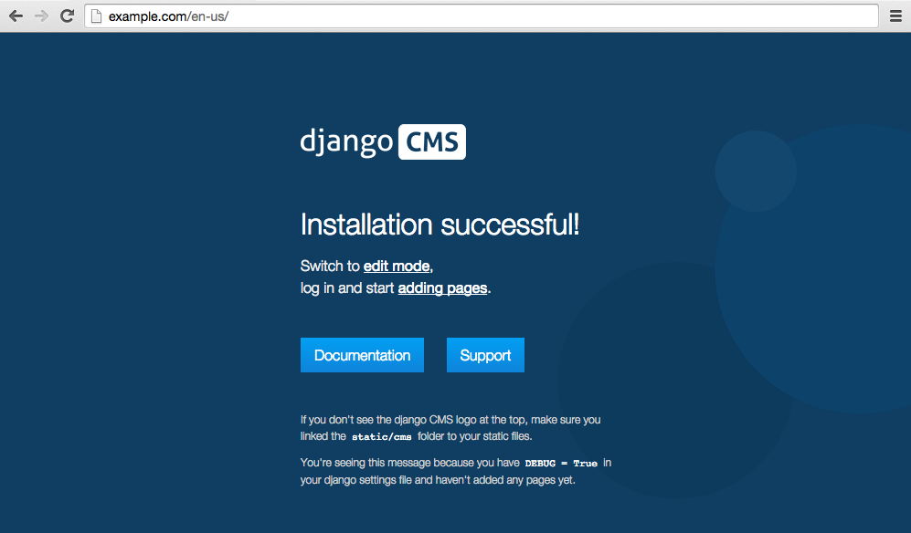
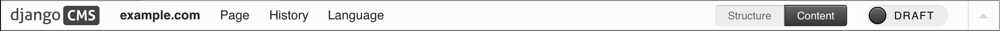
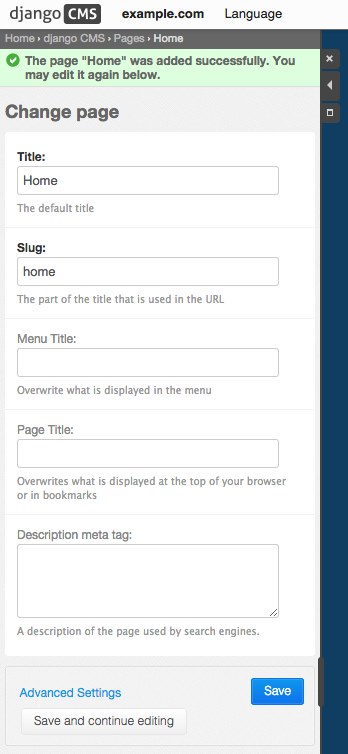
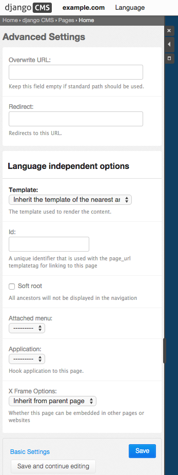

##############
Editing Basics
##############

This guide focuses on the basics of content creation and editing using django
CMS's powerful front-end editing mode. This guide is suitable for non-technical
and technical audiences alike.

This guide can only cover the basics that are common to most sites built
using django CMS. Your own site will likely have many customizations and special
purpose plugins which we cannot cover here. Nevertheless, by the end of this
guide you should be comfortable with the content editing process using django CMS.

Nevertheless, by the end of this guide you should be comfortable with the content
editing process using django CMS.
Many of the skills you'll learn will be transferable to any custom plugins your
site may have.

***************
Getting Started
***************

On a brand new site, you may see the default django CMS page:

|initial-page|

The first step is to log into your site. You will need login credentials which are
typically a username or email address plus a password. The developers of your site
are responsible for creating and providing these credentials to you so consult them
if you are unsure.

Your site will likely have a dedicated login page but a quick way to trigger the
login form from any page is to simply append ``?edit`` to the url (or click the
'Switch to edit mode' link on the default page). This will reveal the toolbar.

|login-form|

.. |login-form| image:: ../images/login-form.png

Once you are logged in, the toolbar will reveal the basic menu options for editors:

|logged-in|

.. |logged-in| image:: ../images/logged-in.png

Let's quickly review the available options. The "django CMS" logo is simply a jump
link back to the 'home' page of your site. The 'example.com' is the site administration
menu:

|toolbar-site-menu|

This menu contains jump links which open up administration controls in a side-frame.

* "Pages ..." takes you directly to the pages editing interface
* "Users ..." takes you directly to the users management panel
* "Administration ..." takes you to the site-wide administration panel
* "User settings ..." allows you to switch the language of the admin interface and toolbar

You can also logout from this menu.

The other menu option is "Language" which is used to switch the current language of the
site you wish to edit. This is only useful for editing a multilingual site where
pages are translated into multiple languages.

Finally, on the far right there is a toggle to collapse/expand the toolbar.

Add a page
----------

Adding a page is as simple as clicking the "Pages..." menu-item in the
"example.com" (or similar) menu in the toolbar.

|pages-menu-item|

.. |pages-menu-item| image:: ../images/pages-menu-item.png

This will reveal the side-frame for administration.

|no-pages|

.. |no-pages| image:: ../images/no-pages.png

Now, click the "add page" button at the top right-hand corner of the side-frame.

|basic-page-form|

.. |basic-page-form| image:: ../images/basic-page-form.png

This is a basic form where you complete the title of the new page. The slug
field is also required but a sensible value will be completed as you type the
page’s title.

The remaining fields are optional but are worth a quick review. "Menu title" is
used to override what is displayed in the navigation. For example, you may want
the page title displayed to users to read "ACME Incorporated: Our story". This is
much too long to fit in the navigation, especially for your mobile users.
"Menu title" allows you to set this to something simpler such as "About". This
allows the title that is displayed in the content of page to be more verbose and
clear and the menu item will remain simple and to the point.

"Page title" and "Description meta tag" are both fields used for SEO purposes.
"Page title" allows you to override the title of a page as seen by search
engines. These titles may sometimes be used by search engines as the title displayed
in search results but are not displayed with the page content to your users.
The "Description meta tag" similarly is also not displayed to end users but is
sometimes used by search engines in display search results. When in doubt, it is
safe to leave these fields blank.

When you are finished entering these fields, press "Save and continue editing".
This will reveal a new button "Advanced Settings".

|save-and-continue|

Click "Advanced Settings" to reveal the additional settings for the page.

|page-advanced-settings|

* "Overwrite URL" allows you to change the url from the default. By default, the
  url for the page is the slug of the current page prefixed with slugs from parent
  pages. For example, the default url for a page might be "/about/acme-incorporated/our-vision/".
  The "Overwrite URL" field allows you to shorten this to "/our-vision/" while
  still keeping the page organized under the "About" page in the navigation.
* "Redirect" allows you to redirect users to a different page. This is useful if
  you have moved content to another page but don't want to break urls your users
  may have bookmarked or affect the rank of the page in search engine results.
* "Template" lets you set the template used by the current page. Your site will
  likely have a custom list of available templates. Templates are configured by
  developers to allow certain types of content to be entered into the page while
  still retaining a consistent layout.
* "Id" is an advanced field that should only be used by developers. Changing this
  without consulting developers may result in a broken site.
* "Soft root" allows you to shorten the navigation hierarchy to something manageable
  on sites that have deeply nested pages. When selected, this page will act as the
  top-level page in the navigation
* "Attached menu" allows you to add a custom menu to the page. This is typically
  used by developers to add custom menu logic to the current page. Changing this
  requires a server restart so should only be changed in consultation with developers.
* "Application" allows you to add custom applications (e.g. a blog app) to the
  current page. This also is typically used by developers and requires a server
  restart to take effect.
* "X Frame Options" allows you to control whether the current page can be embedded
  in an iframe on another web page.

For now, let's leave these fields blank and simply click 'Save'. The side-frame
will redirect you back to the main list of pages.

|my-first-page|

.. |my-first-page| image:: ../images/my-first-page.png

The side-frame itself has a few controls. The "x" closes the side-frame. To reopen
the side-frame, click one of the jump links from site administration menu (e.g.
under "example.com"). The other two side-frame controls minimze and maximize the side-frame.

In the Pages admin itself, there are a couple indicators and controls for pages.
In the above image, the column "EN-US" has a circle indicating whether the "EN-US"
version of a page is published. A green circle indicates that it is published and
a grey circle indicates it is only a "Draft". The "Menu" column indicates whether
the current page is visible in the navigation. For both the language and menu column
you can click the icon to switch the status of the page.

The page title itself (e.g. "Home" is clickable and will load the page in your
browser. Click "Home" to load the home page.

|empty-page|

.. |empty-page| image:: ../images/empty-page.png

When you first create a page, it is by default a "Draft" version of the page.
All other pages will begin in "Draft" mode and will not be visible to the public,
only to other editors. You can easily tell if you are viewing the "Draft" or "Live"
version of a page by looking at the top right of the toolbar. After creating a page,
you will see the "Publish page now" button. We're not quite ready to publish
the home page, first we need to add some content.

Adding content to a page
------------------------

When you are in "Draft" mode, the page is by default set to "Content" editing.
This is helpful when there is already content but for our first page, we don't
have any content yet. Click "Structure" to enter "Structure" mode.

This reveals the 'placeholders' available on the page

Publishing a page
-----------------

There are multiple ways to publish a page including a blue "Publishe page now"
button on the right side of the toolbar if the page is not currently
published. Other ways include a "Publish page" menu item in the "Page" menu in
the toolbar and a publish link inside the "tool-tip" over the colored, round
icon in the language column of the page tree. The latter is useful for
publishing pages without first navigating to them.

Please review this image of the page-tree in the side-frame maximized with the
page menu invoked.

|page-options|

.. |page-options| image:: ../images/page-options.png

Menus
~~~~~

If you would like your page to appear in your menu (or not), you should
familiarize yourself with the option to include or exclude the page from
menus.

Reviewing the image in `publishing a page`_ above, you should also see the
"Hide in navigation" menu option. You can select this, or merely click on the
green checkbox icon beneath "Menu" in the page tree to exclude this page from
any menus.

Similarly, when the page is currently not shown in menus, you can use the
corresponding menu item "Show in navigation" or toggle the now red icon in the
page tree to again show the page in your menus.

Template
~~~~~~~~

Choosing a template for your page is as simple as selecting the desired
template from the "Templates" sub-menu (see image in `publishing a page`_
above). The list of available templates is determined by the CMS_TEMPLATES
list as defined in your project’s settings.

Adding content to a page
------------------------

So far, our page doesn't do much. Make sure it's marked as "published" (see
above), then click on the page's "edit" button.

To add content to your page, click the "structure" mode-button in the toolbar.
This will reveal all of the page’s available placeholders and allow you to add
CMS plugin instances to them.

On any placeholder, click the menu icon on the right side to reveal the list
of available plugins. In this case, we'll choose the Text plugin. Invoking the
Text plugin will display your installed WYSIWYG Text editor plugin. Type in
some text and press "Save". When you save the plugin, your plugin will now be
displayed "inside" the placeholder as shown in this progession of images.

|add-text-plugin|

.. |add-text-plugin| image:: ../images/add-text-plugin.png

To preview the page, click the "Content" mode button in the toolbar. You can
continue editing existing plugins in Content mode simply by double-clicking
the content they present. To add new plugins, or to re-arrange existing ones,
click back into Structure more. When you're ready to share your content with
the world, press the "Publish page now" button.

That's it!

Where to go from here
---------------------

Feel free to play around with the different plugins provided out of the box and
to build great websites!

Developers may wish to read the technical :doc:`/introduction/index` for a walkthrough of the
main features of django CMS.
