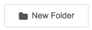
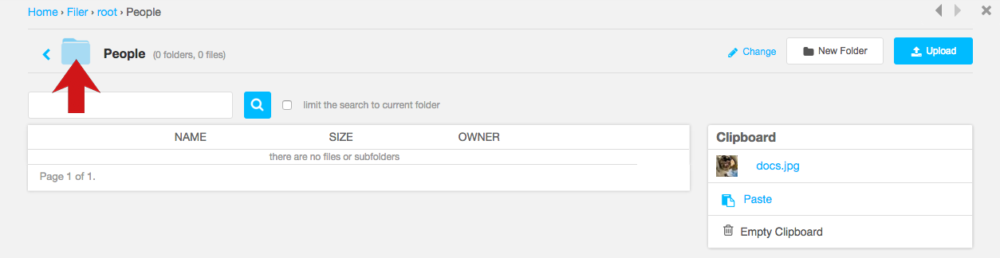
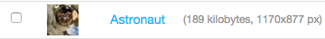
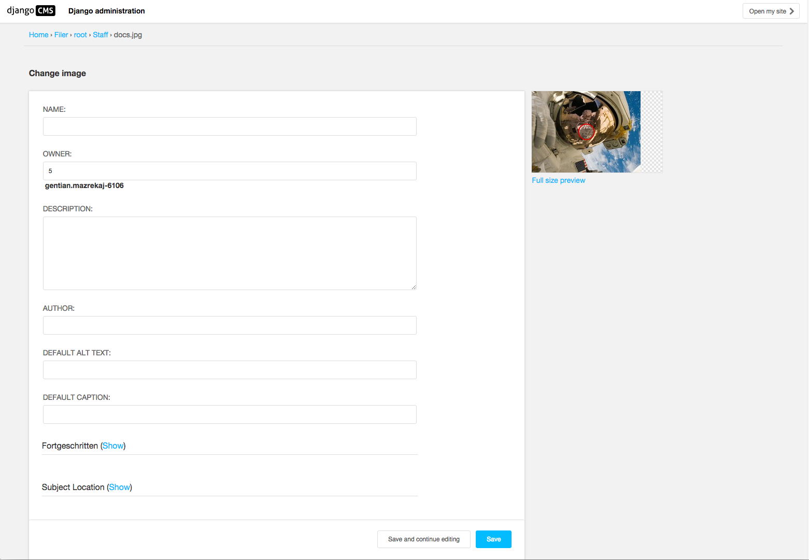
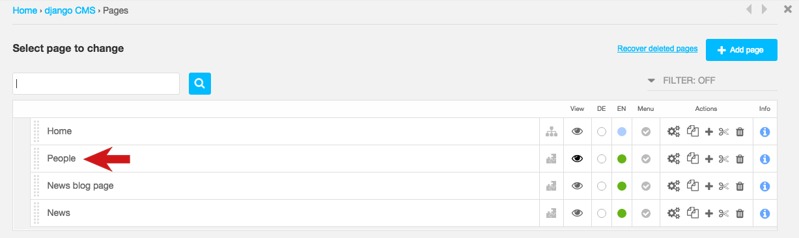

################
The Django Admin
################

******************
Using Django Filer
******************

Using the Filer in the Django Admin
===================================

.. todo:: update for 3.2

.. image:: images/admin_nav.png
   :alt: Navigating to the Django admin
   :align: right
   :width: 40%

In the Toolbar, select the *Site menu* and choose *Administration*.

.. todo:: update for 3.2. -- 3.2 expands admin automatically

.. image:: images/zoom_panel.png
   :alt: The zoom button
   :align: right
   :width: 100%

This opens the django CMS *overlay*, which provides a quick view onto some extra control
functionality.

.. image:: images/admin_site.png
   :alt: The admin site
   :width: 50%

Add an image to the Filer
=============================

.. todo:: screenshots of following steps

.. todo:: write up steps properly

* hit New folder in Filer, create folder called "People"

* open folder

.. image:: images/open_folder.png
   :alt: open the new folder
   :width: 40%

* hit upload button

* hit Paste button

Now you have a resuable image in the Filer.

**************************
Managing files and folders
**************************

Moving items
============

.. todo:: screenshots of following steps

.. todo:: write up steps properly

* move file to clipboard

* move up in folder hierarchy to root level

* create a new folder "Staff" (I think we don't an image again. It repeats itself)

* paste file to new folder (Same here)

Editing items
=============

.. todo:: screenshots of following steps

.. todo:: write up steps properly

You can edit a file's details by selecting it.

* select one of the existing images

* edit ``Name`` and ``Description``

* Choose the image's *focus point* - the point around which any cropping will occur - by dragging
  the red circle in the image pane

    .. image:: images/image_focus.png
        :alt: red dot on image
        :width: 60%

  This helps ensure for example that however a portrait is cropped, the subject's head will not be
  chopped off. If your image doesn't have a particular focus point, leave the circle in the middle
  of the image.

* **Save** the image.

Note that if you change the focus point, any examples of that image already in your pages will
change automatically.

Using images from the Filer
===========================

.. todo:: screenshots of following steps

.. todo:: write up steps properly

* close the admin pane

.. image:: images/close_admin.png
   :alt: close icon of the admin page
   :width: 10%

* go to People page

* select People > Person list
* choose a person
* hit Select this file arrow
* Save Person
