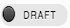
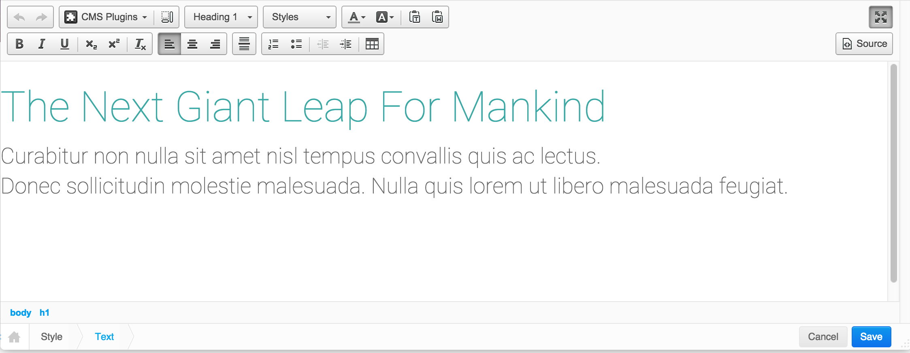
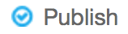
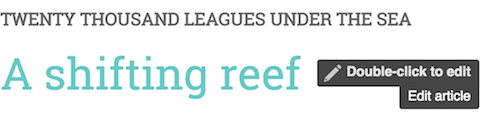
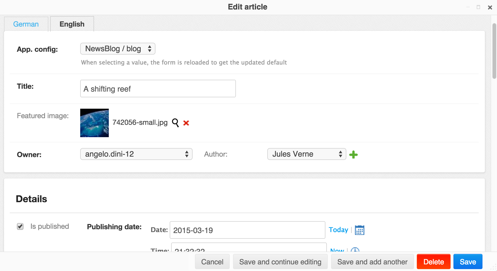
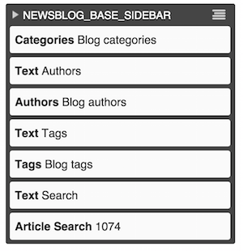
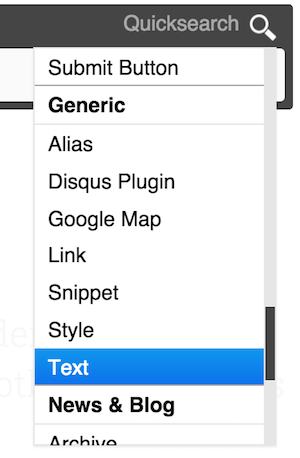
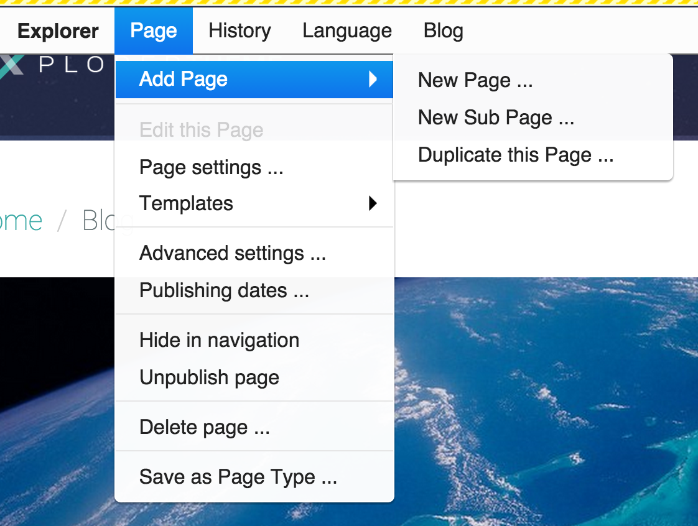

#####################
Basic content editing
#####################

.. _cms_login:

====================
Log in as a CMS user
====================

You should already be logged in to your new Tutorial site, with the django CMS **Toolbar**
displayed at the top of the page.

If not, add ``/?edit`` to the end of the URL to trigger the login prompt.

================
Using Draft mode
================

You're in *Live mode* - see the |live| button in the toolbar. Switch to *Draft mode*, by hitting
the button.

Now you're in *Draft mode* |draft|, you're able to change much of the site's content simply by double-clicking on it.

When you're hovering over editable content, a *Double-click to edit* pop-up will appear alongside
your pointer, along with the name of the content type involved.

.. _edit_some_text:

==============
Edit some text
==============

Choose some text to amend; double-click on it. Whatever the content type, an appropriate pop-up
window containing an editor will appear.

For text, this will generally be the default **rich text editor**, which includes formatting and
other editing controls.

Change some text and hit **Save**.

Your changes are reflected immediately - but only in *Draft mode*. Switch back to *Live mode*,
where you will see that the original text is unchanged. It will remain unchanged in *Live mode*
until you hit **Publish changes**.

This allows you to keep editing and refining your page until you are satisfied with your changes in
*Draft mode*, while leaving the live content undisturbed.

Switch back to *Draft mode* once more, and **Publish** your changes.

===============
Further editing
===============

The same principle of double-clicking to edit applies throughout the system, for example in the
**Aldryn News & Blog** application too.

Aldryn News & Blog is not actually part of django CMS, but it's one of many applications that can
integrate with it, and make use of its editing and publishing features. It's included in this
Tutorial site because a typical django CMS project will feature several other applications, and
many of them are likely to work in similar ways.

From the navigation menu in the Tutorial site, choose *Blog*, to go to the home page of the weblog.

The *Blog* page lists a number of articles, including a snippet of introductory text from each,
along with a publishing date and the author's name, and a link to the full article.

In some cases, for "featured" articles, a large image is displayed too. If you read a full article
and switch to *Draft mode*, you'll see that double-click-to-edit works here too.

Double-clicking in an article's main body of text will open the text editor as before.

Double-clicking on its *title* on the other hand (whether on the article page, or the weblog's home
page) will open a different editor in the pop-up. In this case it's the *Edit article form*, where
you can change settings such as the title, date of publication and so on.

.. note::

   You'll notice that some content appears differently when double-clicked to edit it, or even when
   you simply switch to *Draft mode*. For example, a collection of slides in a carousel will
   display each slide individually, to make them easier to edit.

Unlike pages, weblog articles don't exist in draft and live forms, so any changes you make are
published immediately.

.. _structure-and-content:

===================================
Structure and content editing modes
===================================

.. image:: images/content_mode.png
   :alt: The edit mode switch
   :align: right
   :width: 50%

We're in *content editing mode*, as indicated in the Toolbar. Use the **edit mode switch** to
change to *structure editing mode*.

The content you were looking at will be replaced by a representation of its structure. Each block
of rows represents a **Placeholder**, and each row represents a **Plugin** that has been inserted
into a Placeholder.

When you edited text in the rich text editor, what you edited was one of these plugins.

Double-click on one of the *Text* plugins listed in the *NEWSBLOG_ARTICLE_CONTENT* block. you'll
see that it's the same kind of thing.

============
Add a plugin
============

Find the *NEWSBLOG_ARTICLE_CONTENT* block. Select its **Edit menu**, and scroll down through the
list of available plugin options until you find *Text*.

When you select *Text*, the text editor will pop up as before. Enter some new text, and **Save**
the plugin.

You'll see your new text plugin and its content showing in the list of plugins. Switch back to
*content mode*; now you'll see that the content appears on the page.

We will cover more advanced content editing later on in the tutorial, but in the meantime feel
free to explore, choosing different kinds of content to edit. The pop-up indicator that appears
over editable content provides information about the kind of editor you can expect to open when you
double-click.

=================
Create a new page
=================

In the *Toolbar*, select *Page > Add Page*. Give the page a ``Title`` (you can ignore the other
options for now) and hit **Save** .

Your new - and so far content-free - page will appear in right-hand pane.

Switch to *Structure mode*, and insert a *Text* plugin into the *Content* Placeholder block.

Add some text to the plugin, and **Save**. Switch back to *Content mode* to see your text on the
site.

Hit **Publish Page now** when you're ready for it to be published.
