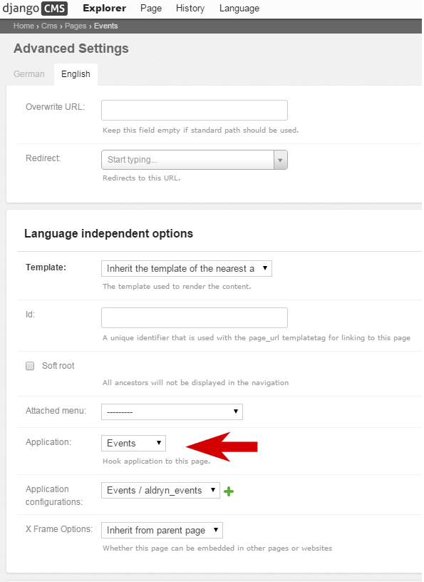
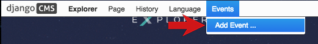
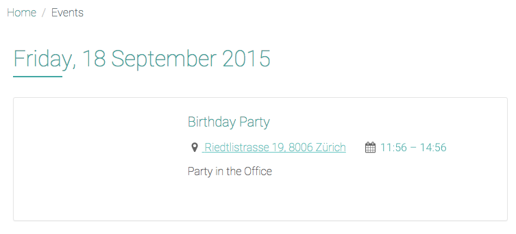
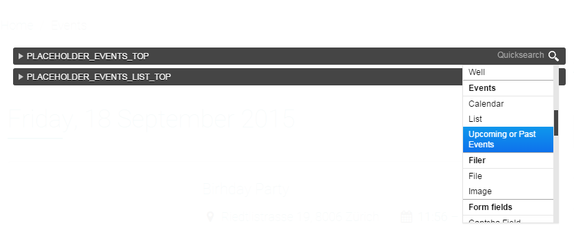
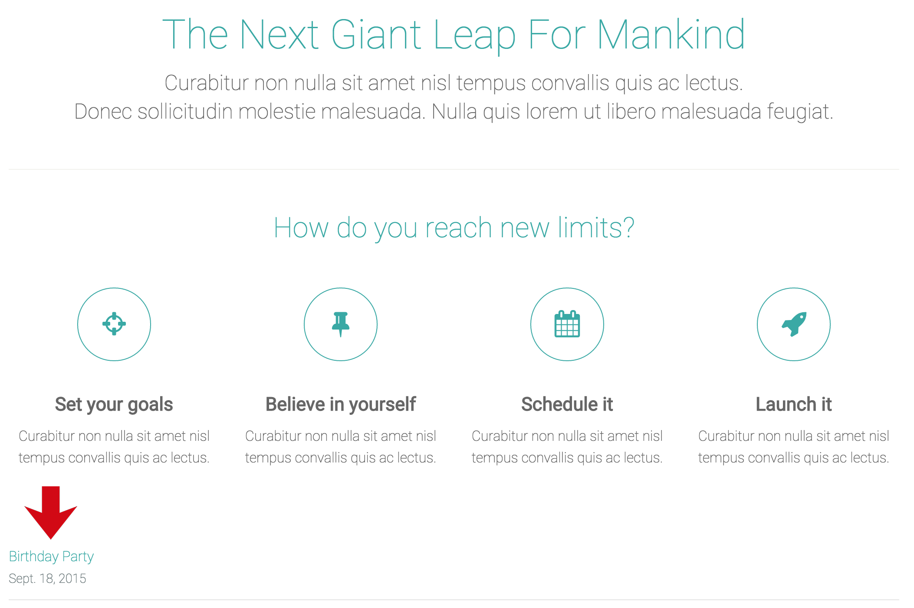

#################################
Using Addons from the Marketplace
#################################

Your *Tutorial site* comes with a number of applications installed by default. As well as django
CMS, you've already encountered Aldryn News & Blog and Django Filer.

There are others too; now we're going to explore Aldryn Events, an application designed to
publish details of your forthcoming and previous events on your site.

=============================
Create an Events landing page
=============================

Your site already has a page called *Blog*, which publishes articles from the Aldryn News & Blog
application - it's a landing page for that application. We're going to create a landing page for
Aldryn Events too.

By default, a django CMS page's content comes from the plugins you insert into it, but if an
application has a django CMS **Apphook**, this application can insert content into your page
automatically.

For example, the Apphook for the Aldryn News & Blog application is what fills your *Blog* page with
the news articles in the system. We'll do the same with Events.

Create a django CMS page to hook the Aldryn Events application into, using *Page > Add Page* from the Toolbar. Call it *Events*, and select **Save and continue editing**.

In your new page's *Advanced settings*, set its ``Application`` to *Events* and **Save** again.

This page is now hooked into to the Aldryn Events application.

============
Add an event
============

When you're on the *Events* page, you'll see that the django CMS *Toolbar* now contains a new item,
*Events*. Select *Add Event...* from this menu.

Provide some basic details:

* the ``Short description`` is a brief summary of the Event, that will be used in lists of Events
* an event must have a ``Start date``, but the other date/time fields are optional
* for the ``Location``, enter as complete address as possible - Aldryn Events will pass this on to
  Google Maps to display a map, so it needs to be unambiguous and accurate

and **Save** your event.

It now exists in the database and will be listed on the *Events* page. Notice that the calendar
also indicates that something’s on.

.. image:: images/calender.png
   :alt: the calendar
   :align: center
   :width: 50%

You can use the standard django CMS placeholder interface to add some more text content to your
events, as you did in :ref:`structure-and-content` earlier.

=============
Using plugins
=============

You've already inserted *Text* plugins into placeholders. Many applications also include their own
plugins, and Events is no exception, offering a number of different plugins.

Go back to the *Home* page, and enter *Structure* mode. Select the *Edit* menu of the *CONTENT*
placeholder, and scroll down through the list of available plugin options until you find the
*Event* plugins. Choose *Upcoming or past events*.

Check the plugin's settings, and **Save**.

The plugin will be inserted at the bottom of the list of plugins in the *CONTENT* placeholder
block, but you can drag it to any position you like (even to another placeholder block).

When you return to *Content* mode, you'll see that on the *Home* page the plugin now automatically
lists the event you created.

